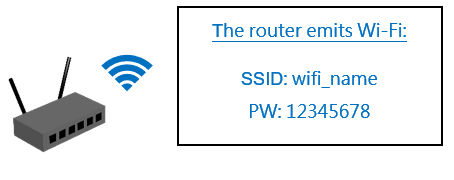
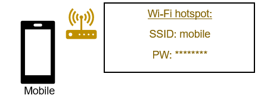
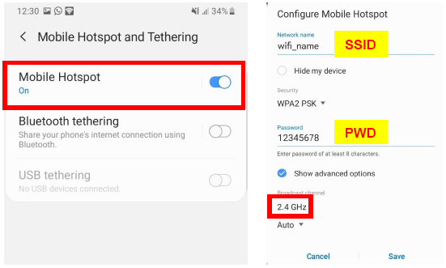
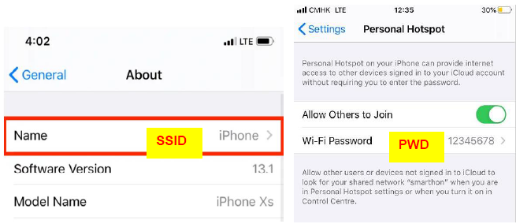
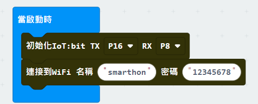
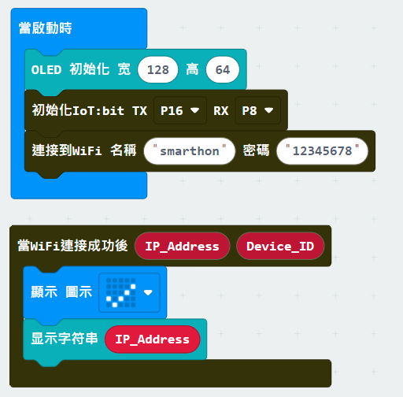
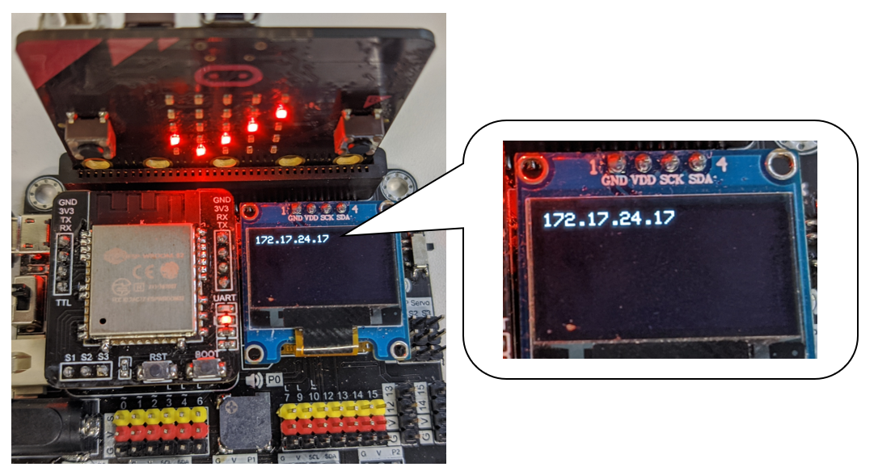
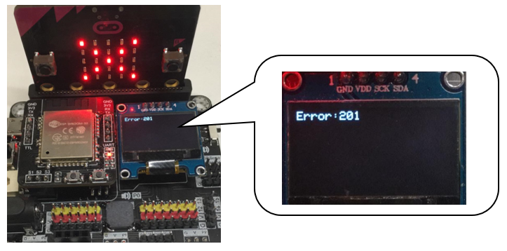

# 把Micro:bit連接到Wi-Fi

在使用各種網絡服務像ThingSpeak、IFTTT、電郵等之前，需要先把Micro:bit與Wi-Fi路由器連接上，才能存取互聯網。 

## 開啟家中的Wi-Fi路由器或是電話上的Wi-Fi熱點

請留意必須使用2.4Ghz頻道的Wi-Fi發射模式，ESP32不支援5Ghz頻道的Wi-Fi連接  
你可以選擇使用家中的Wi-Fi路由器或是由電話Wi-Fi熱點模式所分享的Wi-Fi 

a) 設定你的Wi-Fi路由器所分享的Wi-Fi 

b) 設定你電話熱點分享的Wi-Fi 

* 請先確定你的電話能夠連接互聯網 

Android電話的設定方法: 

iPhone的設定方法: 

## 編程(MakeCode)

第一步驟:初始化IoT:bit 

每次編程時，你需要先初始化IoT:bit才能夠正常使用 
* 前往IoT:bit分頁
* 把 `初始化IoT:bit TX RX` 拖動到 `當啟動時` 裡面

第二步驟: 連接Wi-Fi 

當你初始化IoT:bit後，你可以開始連接Wi-Fi 
* 前往IoT:bit分頁
* 把「`連接到WiFi 名稱 密碼`」拖動到「`初始化IoT:bit TX RX`」下方
* 輸入你的Wi-Fi名稱以及密碼

第三步驟: 成功連接後以圖案表達 

「`當Wifi連接成功後`」是一個事件處理器，當你成功連接Wi-Fi後，裡面的程式就會被執行。 
當你成功連接後，會獲得兩個變數，分別為`IP地址`及`裝置ID`，利用這兩個變數可以令你輕易地透過網路上控制你的Micro:bit。 
* 拖動「`當Wifi連接成功後`」到平台上
* 在「`基本`」分頁，拖動「`顯示 圖示`」到「`當Wifi連接成功後`」裡面
* 把圖示切換成`剔` 

第四步驟: 顯示你的IP地址 

如果你想知道你的IP地址，你可以把這顯示在顯示屏上 
* 前往「`OLED`」分頁
* 把「`OLED 初始化 寛128 高64`」拖動到「`當啟動時`」裡
* 把「`顯示字符串`」拖動到「`當WiFi連接成功後`」裡面
* 把「`當WiFi連接成功後`」裡面的變數「`IP_Address`」拖動到「`顯示字符串`」的輸入格裡
* 你亦可以透過 「`進階->文字`」分頁裡的功能控制顯示的文字格式 

<B><u>額外功能</u></B>: 
和「`當Wifi連接成功後`」接收成功連接Wi-Fi事件一樣，當你的Wi-Fi連線斷開時，亦會觸發另一個事件。這時候你可以用「`當Wifi斷線`」來得知情況及原因，並作出相應的處理，如顯示`X圖案`及把`錯誤碼`顯示在顯示屏上 

完整程式 

MakeCode: [https://makecode.microbit.org/_JcPFw01R0b6F](https://makecode.microbit.org/_JcPFw01R0b6F) 

你亦可以從以下網頁下載程式HEX檔案 
<iframe src="https://makecode.microbit.org/#pub:_JcPFw01R0b6F" width="100%" height="500" frameborder="0"></iframe>

## 成果

第一步驟 

把編寫好的程式先上載到Micro:bit，插入IoT:bit後，連接電源並打開開關 
.

第二步驟 

程式會開始執行並嘗試連接Wi-Fi，當成功連接後，會顯示出路由器分派給Micro:bit的IP地址。 同時Micro:bit上也會顯示圖案 

若你有在編程時添加好斷線的處理，你亦可以在此測試。當你連接Wi-Fi後，嘗試把路由器關閉以切斷與Micro:bit的連線，這次將會在斷線後顯示X圖案及提示錯誤碼201，這代表「沒找到路由器」(因為我們已關上)。 
斷線或無法連接的原因通常是:
1. 距離路由器過遠
2. 沒法找到該路由器
3. 輸入錯誤的名稱或密碼
4. 電池盒電源不足,建議替換新電池
5. 沒有切換成2.4Ghz頻率的Wi-Fi
6. 跟隨[完整操作](https://smarthon-docs-en.readthedocs.io/zh_TW/latest/IoTbit/Introduction.html#id10)使用IoT:bit

詳細的錯誤碼資訊可參考[NodeMCU Documentation](https://nodemcu.readthedocs.io/en/dev-esp32/modules/wifi/)

