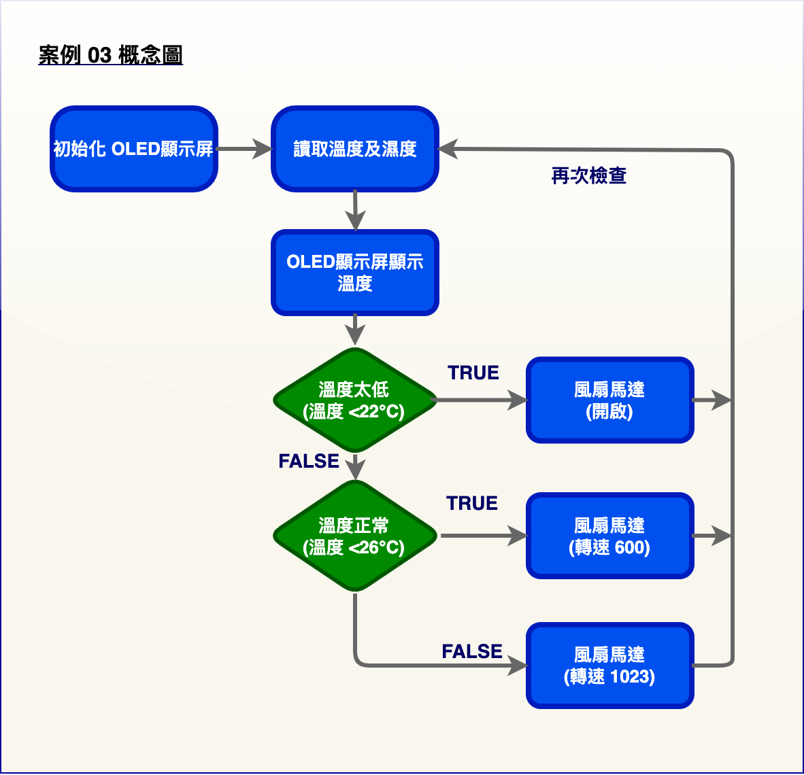
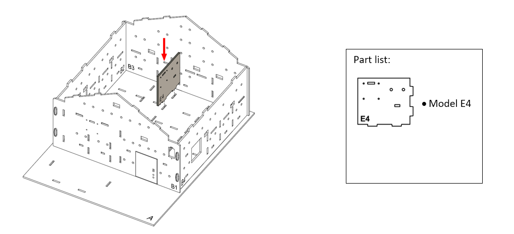
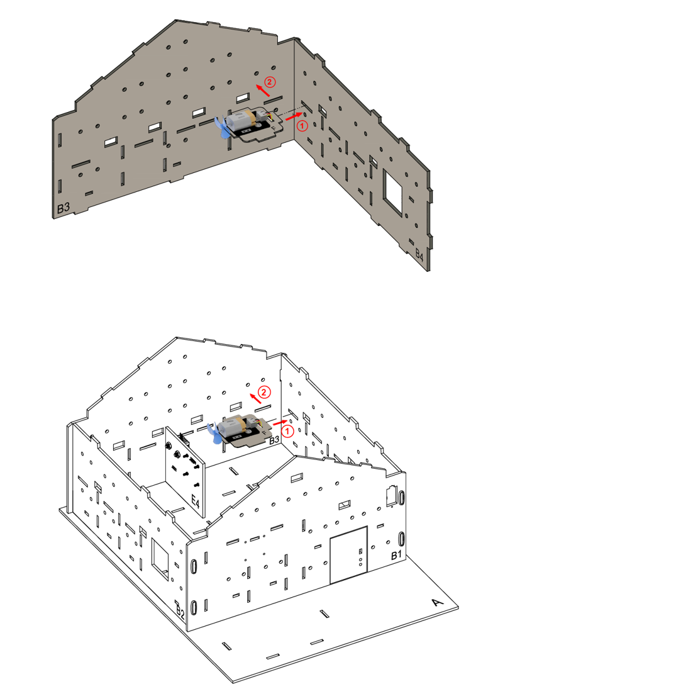
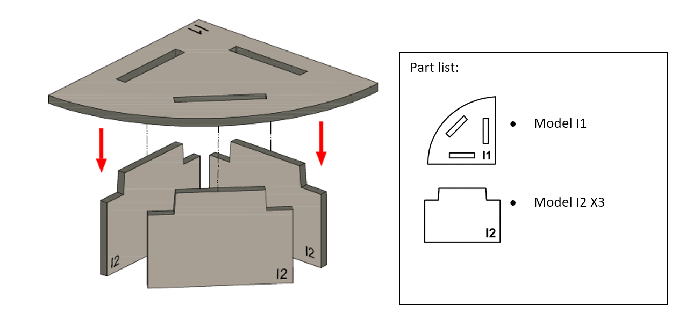
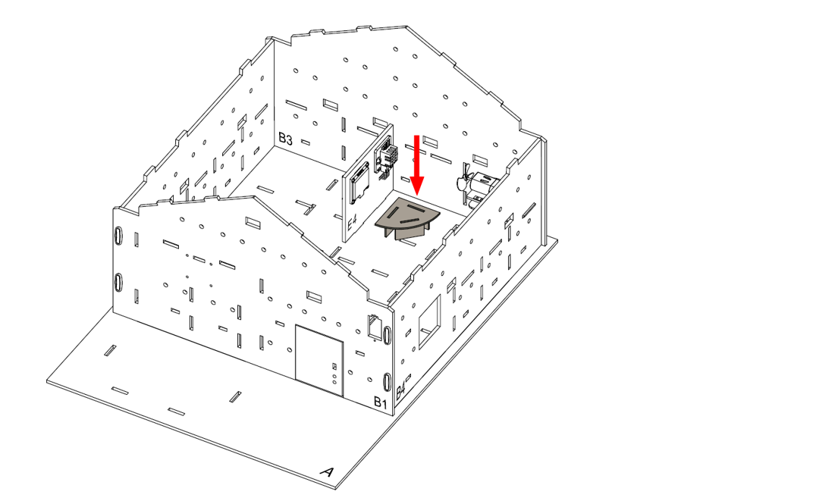
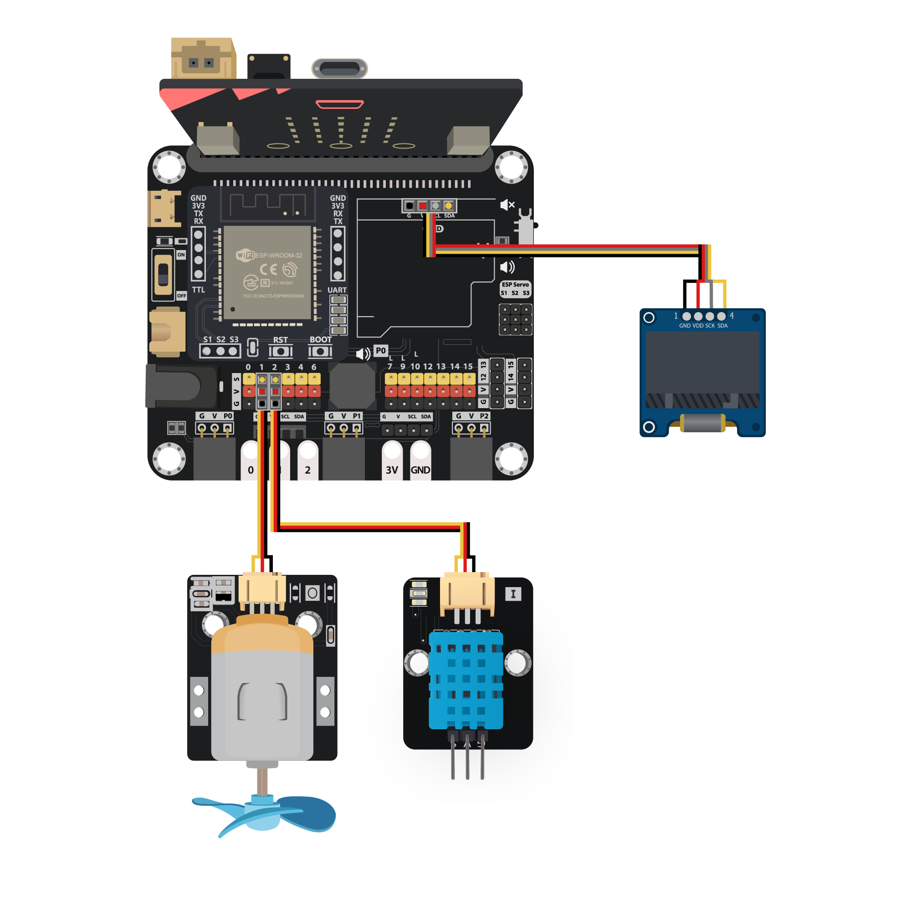
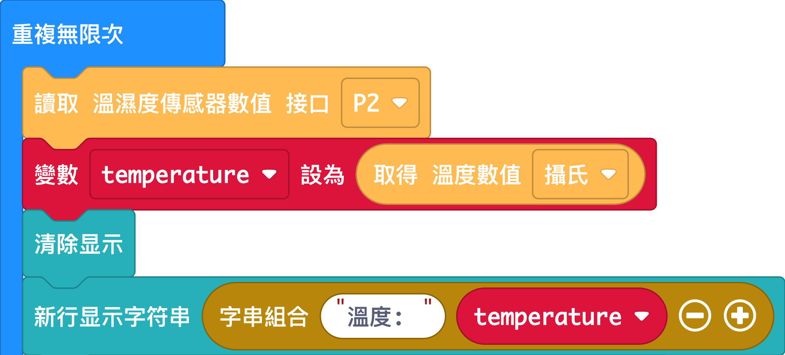
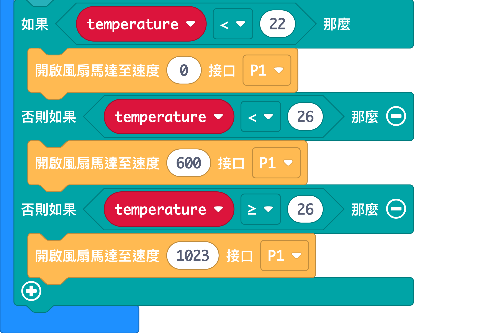

# 案例 03：智能環保風扇

難度：

## 目標

製作一個能透過偵測周遭環境而調整風速的智能環保風扇。 

## 背景

甚麼是智能環保風扇？

智能環保風扇是一個能夠自動調整風速及開關的風扇，用以節省電力。 

運作原理

在屋內安裝溫度及濕度傳感器，用以持續測量周遭環境。當溫度正常或太低時，風扇會自動調低強度或關閉；當溫度太高時則會調高。 

## 所用部件

## 組裝步驟

步驟一 

首先組裝大房子模型。 

步驟二 

把 E4 模型裝到 A 模型上作為牆壁，以在家裡右側建造一個小的客廳。 

步驟三 

用 M4 * 10 毫米螺絲及螺母把溫度及濕度傳感器安裝到 E3 模型上。 

步驟四 

用 M2 * 10 毫米螺絲及螺母把 OLED 顯示屏安裝到 E3 模型上。 

步驟五 

用 M4 * 10 毫米螺絲及螺母把風扇馬達安裝到 F 模型上，連接線可以穿過旁邊的孔。 

步驟六 

把 F 模型裝到 B3、B4 模型上以搭建一個風扇架。 

步驟七 

把 I1 模型裝到三個 I2 模型上以建造一張桌子。 

步驟八 

桌子完成了！ 

步驟九 

把桌子放入客廳。 

步驟十 

組裝完成！ 

## 線路連接

1. 連接溫度及濕度傳感器（DHT11）到 P2 端口
2. 連接擴展 OLED 顯示屏到 I2C 端口
3. 連接風扇馬達到 P1 端口

## 編程（MakeCode）

步驟一. 初始化OLED顯示屏

* 把`OLED 初始化 寬128 高64`加入到`當啟動時`，以初始化 OLED顯示屏

步驟二. 建立變數

* 建立一個名為`temperature`的變數

步驟三. 讀取並顯示 DHT11的讀數

* 在`重複無限次`中，用`讀取溫濕度傳感器數值接口P2`讀取數據
* 從數據中提取溫度值，並用`變數temperature設為取得溫度數值攝氏`將其儲存到變數中
* 建議每次都先清除 OLED 顯示屏上的顯示才更新屏幕資訊
* 用`清除顯示`來清除顯示。
* 然後用`新行顯示字符串字符組合溫度: temperature`來以編排好的文本顯示溫度值

步驟四. 檢查溫度

* 在`重複無限次`加入一個巢狀的`如果-否則`語句
* 第一個條件為`temperature < 22`
* 在第一個`如果`段中，用`開啟風扇馬達至速度 0 接口 P1`來關閉風扇
* 第二個條件為`temperature < 26`
* 在第二個`如果`段中，用`開啟風扇馬達至速度 600 接口 P1`來以一半速度運行風扇
* 第三個條件為`temperature ≥ 26`
* 在第三個`如果`段中，用`開啟風扇馬達至速度 1023 接口 P1`來以全速運行風扇

完整答案 

MakeCode: [https://makecode.microbit.org/_1m42k8eh9a2q](https://makecode.microbit.org/_1m42k8eh9a2q) 

你可以從以下網頁中下載HEX檔案： 
<iframe src="https://makecode.microbit.org/#pub:_1m42k8eh9a2q" width="100%" height="500" frameborder="0"></iframe>

## 結果

當室內溫度變化時，會符合三個條件其中一個，然後風扇馬達會根據溫度以不同的速度運行或關閉。 

## 思考

Q1. 除了開風扇還有什麼方法可以降溫？ 

