# 案例 07：智慧遙控音樂燈

難度：

## 發送器

### 目標

製作一個控制客廳音樂燈的遙控。 

### 背景

甚麼是智慧遙控音樂燈？

現在很多家庭電器都可以遙距控制。這個案例說明了智能家居中遙控的概念。屋主可以按下遙控器來控制客廳的氛圍。（音樂和燈光的變化） 

遙控運作原理（發送器）

- micro:bit 內置廣播功能，兩個或以上的 micro:bit 可以組成一個群組並在小範圍內通訊。
- 在這個案例下，這個 micro:bit 發送器（遙控）會與接收器一起加入群組 1。當我們按下 micro:bit 上的不同按鈕時，它會傳送不同的訊息（模式）給另一個 micro:bit，讓接收器執行相應的動作。
- 這些訊息分別代表「有趣」、「興奮」和「停止音樂」模式。
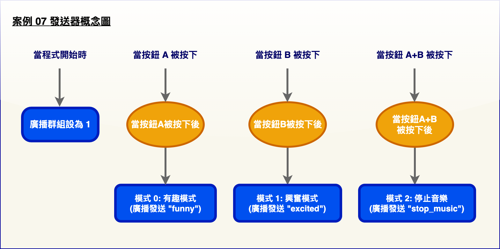

<H3>發送器</H3>
### 所用部件

### 組裝步驟

不適用

### 線路連接

不適用

### 編程（MakeCode）

步驟一. 連接到廣播群組

* 在`當啟動時`裡，加入`廣播群組設為 1`以加入廣播群組 1

步驟二. 向群組發送訊息

* 放入一個`當按鈕 A 被按下`
* 在裡面加入一個`廣播發送文字 funny`以發送訊息`funny`到廣播群組 1 的 micro:bits
* 重複以上步驟，並更改觸發按鈕和文字，以創建`excited`和`stop_music`的訊息發送器
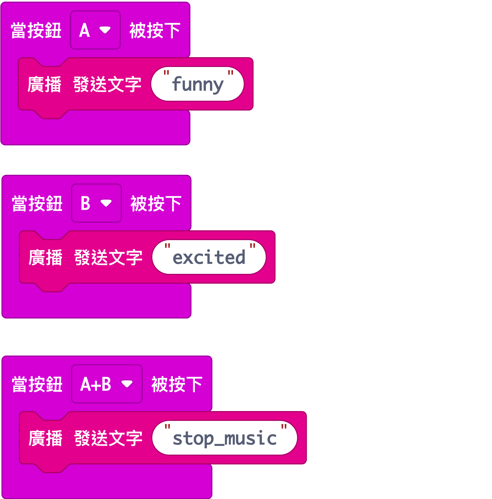

完整答案 

MakeCode: [https://makecode.microbit.org/_72E9Ki1iYRJ7](https://makecode.microbit.org/_72E9Ki1iYRJ7) 

你可以從以下網頁中下載HEX檔案： 
<iframe src="https://makecode.microbit.org/#pub:_72E9Ki1iYRJ7" width="100%" height="500" frameborder="0"></iframe>

### 結果

將程式下載到 micro:bit 後

當按下按鈕 A，micro:bit 會發送訊息`funny`到`群組 1`。

當按下按鈕 B，micro:bit 會發送訊息`excited`到`群組 1`。

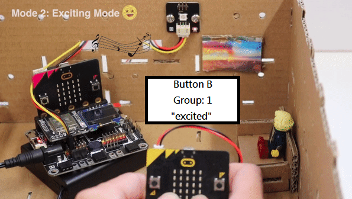

當同時按下按鈕 A 和 B，micro:bit 會發送訊息`stop_music`到`群組 1`。

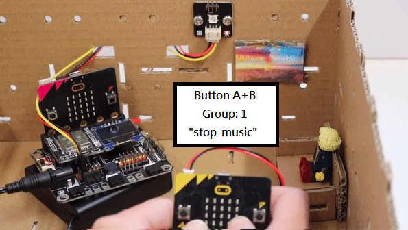

### 思考

Q1. 除了按按鈕之外，還有其他方式可以決定如何發送訊息嗎？

## 接收器

### 目標

製作一個由遙控控制的客廳音樂燈。 

### 背景

音樂燈運作原理（接收器）

當這個 micro:bit 接收到另一個 micro:bit（遙控）的訊息時，它會用蜂鳴器播放不同的音調或音樂，同時彩色 LED 會配合氛圍變化。有3種模式，一種是有趣模式，另一種是興奮模式，最後一種是停止音樂。

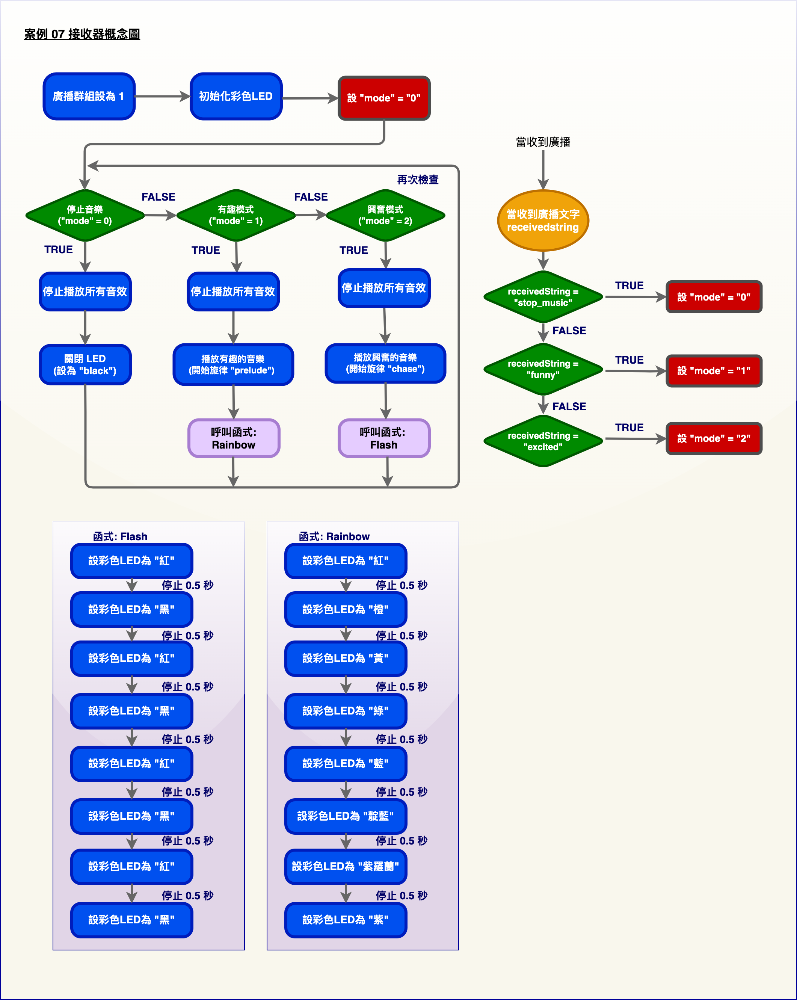

### 所用部件

### 組裝步驟

步驟一

這個案例以「大房子模型」作為房子的基礎。 

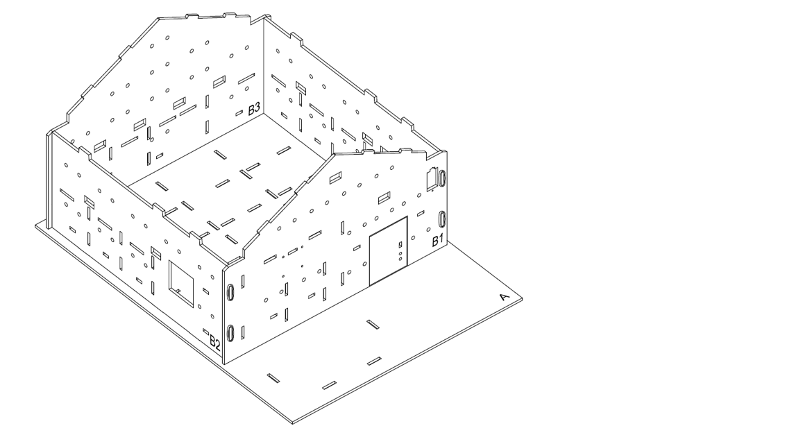

步驟二

我們來建造一個客廳。對準 A 和 B3 模型上的孔，將 E1 模型放到 A 模型上。 

步驟三

用 M4*10 毫米螺絲及螺母把彩色 LED 安裝到 B3 模型上，連接線應穿過旁邊的孔。 

步驟四

我們來製作一張沙發。將兩個 K3 模型裝到 K1 模型的兩側。 

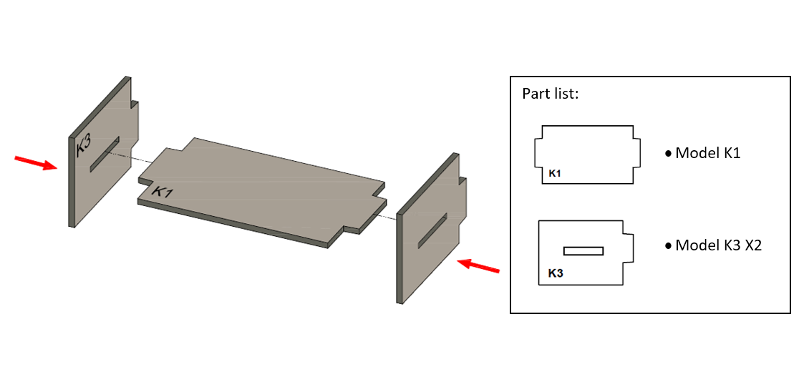

步驟五

將 K2 模型與 K1-K3 模型組裝到一起。 

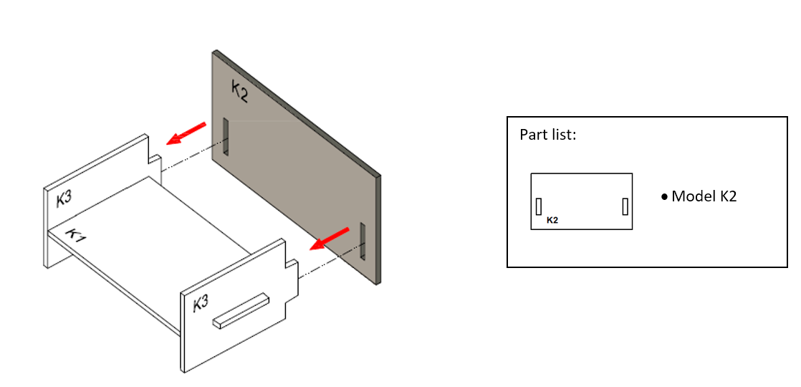

步驟六

沙發完成！ 

步驟七

把沙發放到客廳裡。 

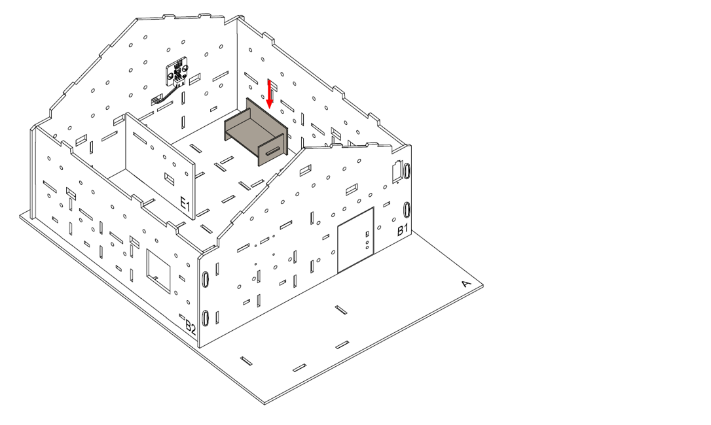

步驟八

把 H 模型裝在 B3 模型上，作為裝飾擺設。 

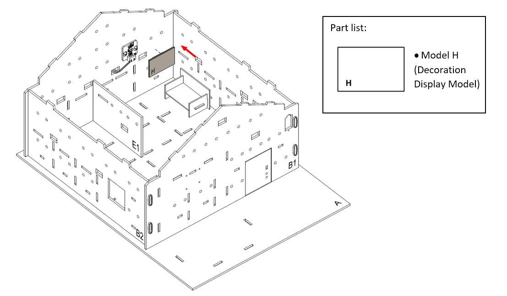

步驟九

組裝完成！ 

### 線路連接

1. 連接彩色 LED 到 P1 端口
2. 把蜂鳴器開關向下撥以連接蜂鳴器

### 編程（MakeCode）

步驟一. 連接到廣播群組並初始化 LED 和變數「mode」

* 建立一個名為`mode`的變數
* 在`當啟動時`裡，加入`廣播群組設為 1`以加入廣播群組 1
* 用`變數 strip 設為引腳 P1 初始化燈帶 1 顆LED（模式 RGB（GRB 順序））`啟動彩色 LED
* 用`變數 mode 設為 0`把變數`mode `的值設為 0

步驟二. 判斷廣播訊息並採取行動

* 放入一個`當收到廣播文字 receivedstring`
* 在裡面加入一個巢狀的`如果-否則`語句
* 在第一個條件，用`receivedstring = stop_musi`過濾出訊息`stop_music`，然後將變數`mode`更改為 0
* 在第二個條件，用`receivedstring = funny`過濾出訊息`funny`，然後將變數`mode`更改為 1
* 在第一個條件，用`receivedstring = excited`過濾出訊息`excited`，然後將變數`mode`更改為 2

步驟三. 製作改變顏色的函式

* 建立兩個名為`rainbow`和`flash`的函式
* 在每個函式中，用`strip 顯示顏色XXX`和`暫停XXX毫秒`來創造出您想要的顏色變化模式

步驟四. 透過變數改變 LED 顏色

LED 的顏色應跟隨變數變化

mode | 意思
 :| :  
0|stop_music
1|funny
2|excited

* 在`重複無限次`加入一個巢狀的`如果-否則`語句
* 設`mode = 0`為第一個條件
* 在代表`stop_music`的第一個`如果`段中，用`停止播放所有音效`來停止播放音樂
* 然後用`strip 顯示顏色黑`來關閉 LED
* 設`mode = 1`為第二個條件
* 在代表`funny`的第二個`如果`段中，先用`停止播放所有音效`來停止播放音樂，再用`play melody prelude until done`來播放有趣的音樂
* 透過`呼叫 Rainbow`執行函式，將燈光轉為彩虹模式
* 設`mode = 2`為第三個條件
* 在代表`excited`的第三個`如果`段中，先用`停止播放所有音效`來停止播放音樂，再用`play melody chase until done`來播放興奮的音樂
* 透過`呼叫 Flash`執行函式，將燈光轉為閃爍模式
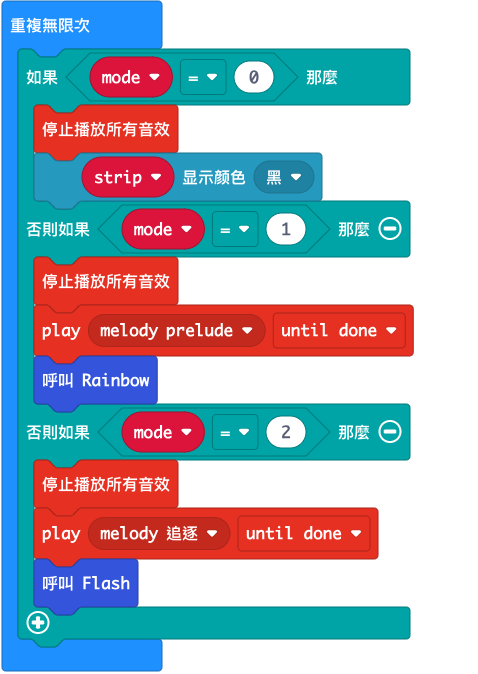

完整答案 

MakeCode: [https://makecode.microbit.org/_4E7CkjTLWFLV](https://makecode.microbit.org/_4E7CkjTLWFLV) 

你可以從以下網頁中下載HEX檔案： 
<iframe src="https://makecode.microbit.org/#pub:_4E7CkjTLWFLV" width="100%" height="500" frameborder="0"></iframe>

### 結果

將程式下載到 micro:bit 後，
當接收到訊息`funny`，micro:bit 會播放有趣的音樂，而燈光會以彩虹模式亮起。 
當接收到訊息`excited`，micro:bit 會播放興奮的音樂，而燈光會以閃爍模式亮起。 
當接收到訊息`stop_music`，micro:bit 會停止播放音樂並關掉燈。
 

### 思考

Q1. 除了內建的旋律之外，你能製作自己的音樂旋律嗎？ 

Q2. 您可以利用廣播功能來控制其他硬件，例如風扇嗎？ 

