# 物聯網案例 11：廚房火災警報系統

難度：
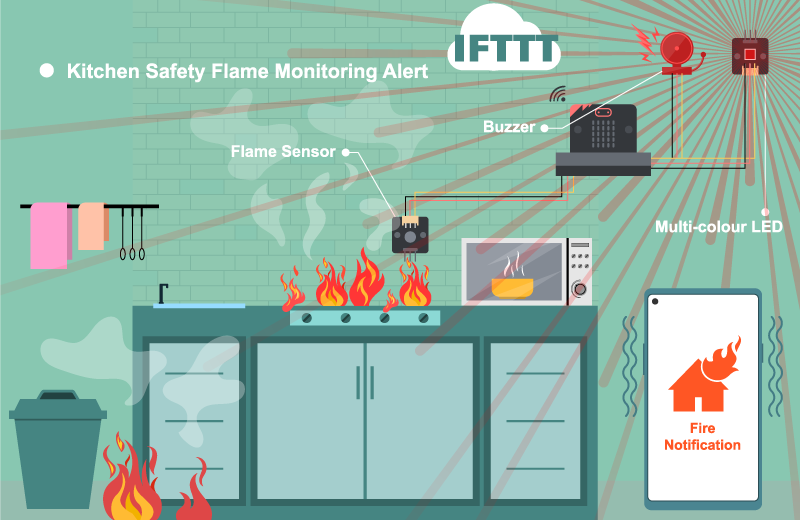

## 目標

製作一個會偵測附近是否有強火的火災警報系統。 

## 背景

甚麼是廚房火災警報系統？

火災事故經常發生在住戶睡著或不在家的時候。為了防止可怕的火災事故，在廚房或客廳安裝一套 IoT 系統是個好辦法，該系統可以在住戶睡覺或外出時透過手機提醒住戶。 

運作原理

在廚房區域安裝火焰傳感器後，系統會在偵測到火災時觸發警報並閃爍紅色 LED 燈以提醒家中的住戶。同時，它也會向住戶的手機發送 IFTTT 通知，即使住戶睡著或不在家也能收到警報。 

## 所用部件

## 組裝步驟

步驟一 

這個案例以「大房子模型」作為基礎。 

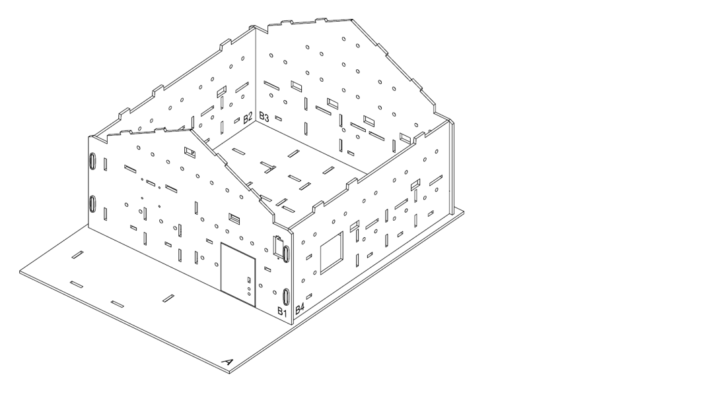

步驟二 

對準 A、B1 和 B2 模型上的孔，將 E1和 E3 模型組裝到 A 模型上，以建立一個廚房。 

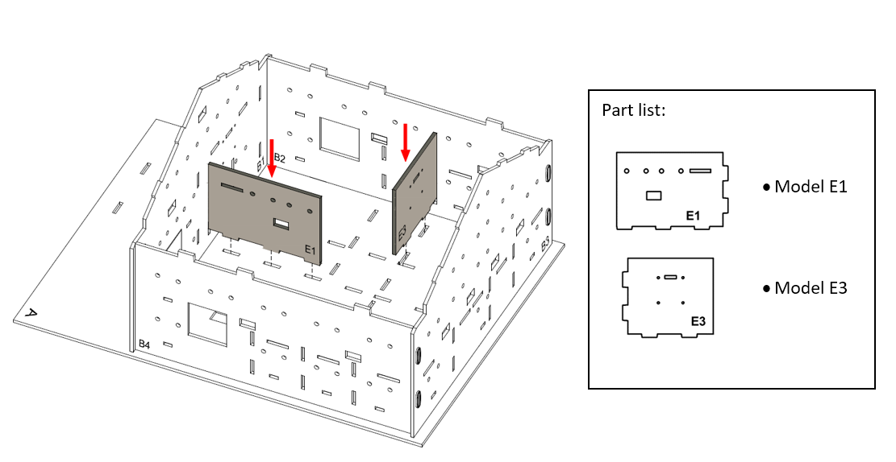

步驟三 

用 M4*10 毫米螺絲及螺母把火焰傳感器安裝到 E4 模型上，連接線穿過旁邊的孔。 

步驟四 

用 M4*10 毫米螺絲及螺母把彩色LED安裝到 E4 模型上，連接線穿過旁邊的孔。 

步驟五 

我們來製作一個煮食爐模型。將 L2 模型從上到下放置到 L1 模型。 

步驟六 

按照箭頭方向將 L1 模型折向 L2 模型。 

步驟七 

按照箭頭方向將 L1 模型的另一側折向 L2 模型。 

步驟八 

貼上爐灶圖案的紙貼。 

步驟九 

煮食爐完成了。 

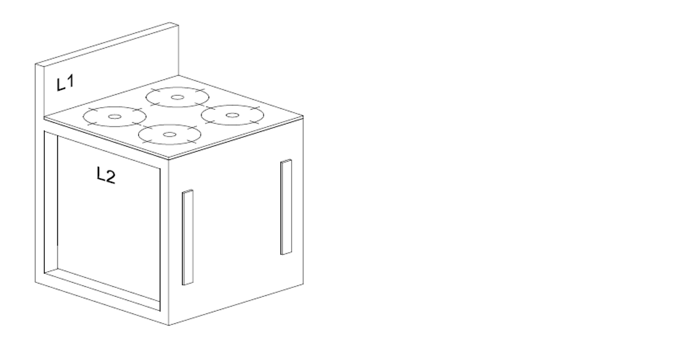

步驟十 

將煮食爐模型放在廚房。 

步驟十一 

用 M4*10 毫米螺絲及螺母把光度傳感器安裝到 G1 模型上，以製作一台冰箱，連接線穿過旁邊的孔。 

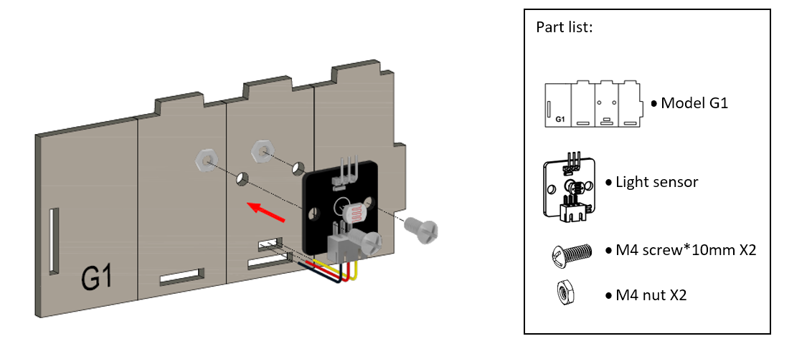

步驟十二 

將 G1 模型如圖中折疊和彎曲，然後對準孔，將 G3 模型拼到 G1 模型中。 

步驟十三 

對準孔，將 G2 模型裝到 G1 模型上。 

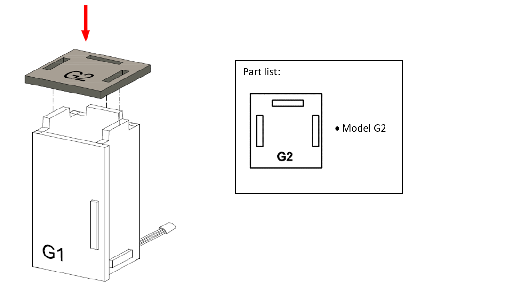

步驟十四 

冰箱完成。 

步驟十五 

把冰箱放到廚房角落。 

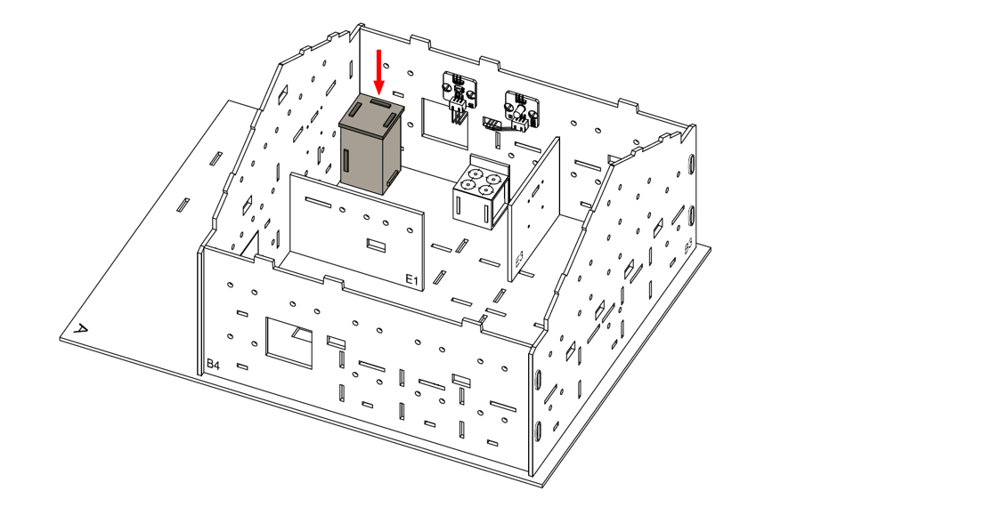

步驟十六 

組裝完成！ 

## 線路連接

1. 連接火焰傳感器到 P2 端口
2. 連接彩色LED到 P1 端口
3. 把蜂鳴器開關向下撥以連接蜂鳴器

## 物聯網（IFTTT）

### 第一部分：設定 IFTTT
1. 建立 IFTTT 帳戶並登入
2. 創建一個新的 Applet
3. 在 IF 中，搜尋「Webhooks」並點擊 Webhooks 應用程式 

4. 選擇「Received a web request」然後輸入事件名稱「fire」 

5. 在 THEN 中，搜尋「Notifications」並點擊 Notifications 應用程式
6. 選擇「Send a notification from the IFTTT App」 

7. 完成 Applet 的設定後，按一下 Webhooks 圖示 --> Documentation 

 

8. 複製 key 

<H4>可選：使用電子郵件作為通知方法</H4>

在 THEN 欄位中，搜尋「email」並使用它來取代上一步驟中的「Notifications」
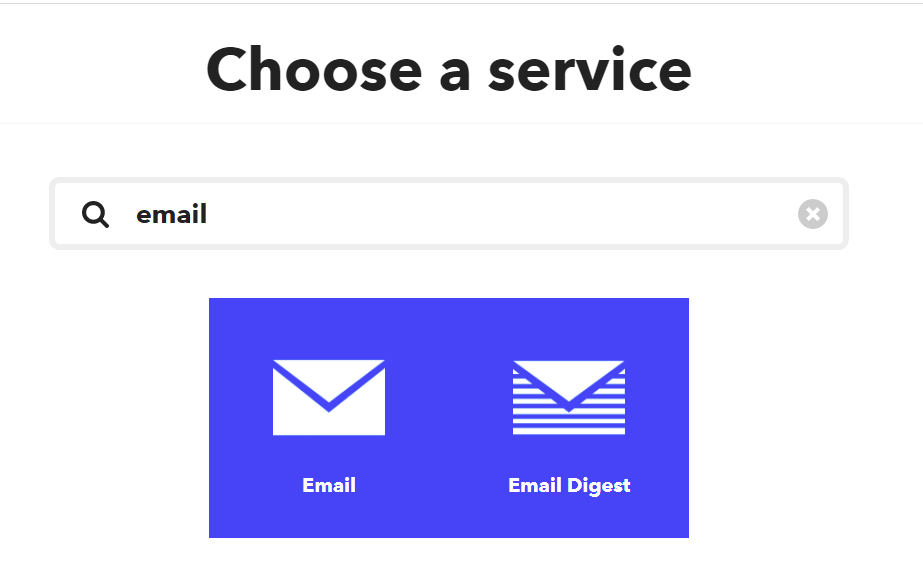

### 第二部分：在智能電話上安裝 IFTTT 應用程式
1. 前往 <U>Play商店</U> 或 <U>App Store</U> 搜尋並下載 IFTTT App

2. 登入你的 IFTTT 帳戶
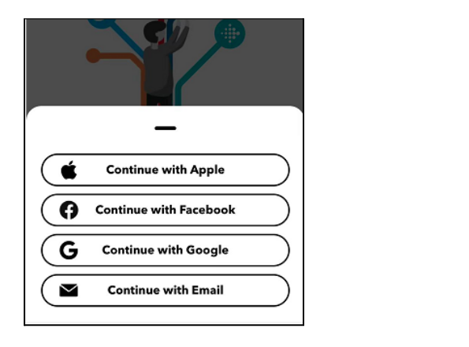

## 編程（MakeCode）

步驟一. 初始化OLED、IoT:bit；連接WiFi；啟動彩色LED

* 在`當啟動時`加入`OLED 初始化寬128高64`
* 加入`初始化IoT:bit TX P16 RX P8`
* 加入`連接到 WiFi 名稱 密碼`並輸入 WiFi 名稱和密碼
* 加入`變數 strip 設為引腳 P1 初始化燈帶 1 顆LED（模式 RGB（GRB 順序））`
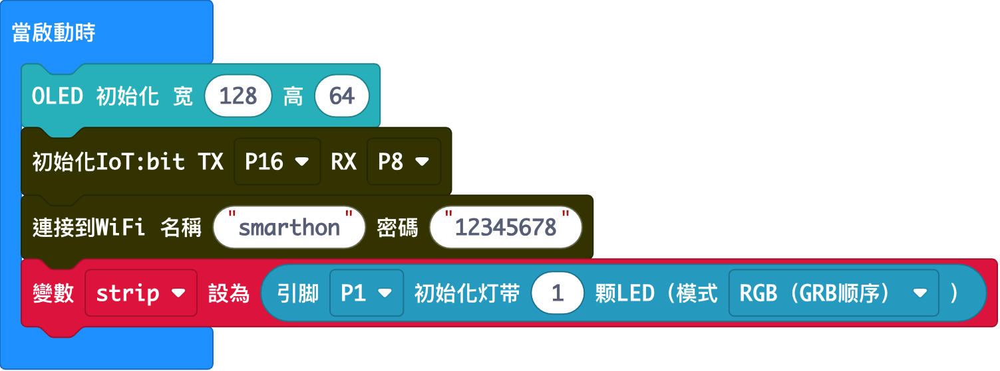

步驟二. 檢查 Wi-Fi 連線狀態

* 放入一個`當WiFi連接成功後`
* 在裡面加入`顯示圖示勾號`，以在連線後顯示勾號

步驟三. 檢查網路連線狀態

* 在`重複無限次`加入一個`如果`語句，條件設為`WiFi 連接狀態`以檢查連線狀態

步驟四. 檢查火焰傳感器的回傳結果和警報聲

* 在`如果`裡加入另一個`如果`語句，條件設為`取得火焰檢驗器數值接口 P2 = true`來識別火焰
* 偵測到火焰時播放警報聲

步驟五. LED燈警報

* LED 應該閃爍以警告危險
* 加入`strip 顯示顏色紅`以亮起紅色 LED
* 加入`暫停 100 毫秒`以暫停 0.1 秒
* 加入`strip 顯示顏色黑`以關閉 LED
* 再次暫停 0.1 秒

步驟六. 傳送到 IFTTT

* 放入一個`發送到 IFTTT key* XXX 事件名稱 XXX`將事件傳送到 IFTTT
* 在空格填上你的 Webhooks 上的 IFTTT Key 以及 Applet 的事件名稱

步驟七. 檢查上傳情況

* 用`當上傳到 IFTTT 後`取得上傳結果以檢查上傳的情況
* 用 OLED 顯示屏顯示資訊
* 加入`清除顯示`以在每次刷新前清除顯示
* 加入`新行顯示字符串 字串組合 IFTTT: Status`以顯示上傳狀態
* 加入`新行顯示字符串 字串組合 Error: Error_code`以顯示上傳失敗時的錯誤代碼

完整答案 

MakeCode: [https://makecode.microbit.org/_2pTc5eRp6DRq](https://makecode.microbit.org/_2pTc5eRp6DRq) 

你可以從以下網頁中下載HEX檔案： 
<iframe src="https://makecode.microbit.org/#pub:_2pTc5eRp6DRq" width="100%" height="500" frameborder="0"></iframe>

## 結果

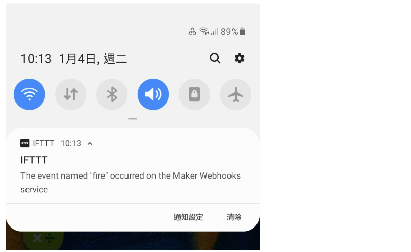

## 思考

Q1. 當我們偵測到火焰時，除了發出警報之外，我們還能做什麼？（例如添加風扇或灑水器來滅火？ 自動報警？） 

