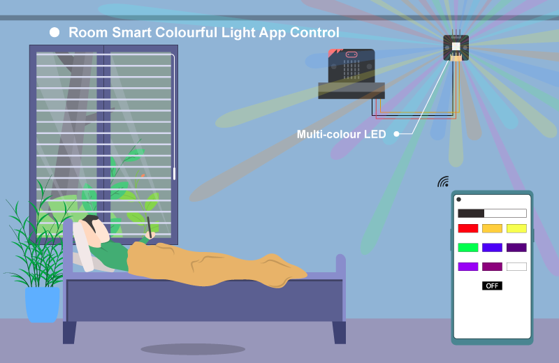
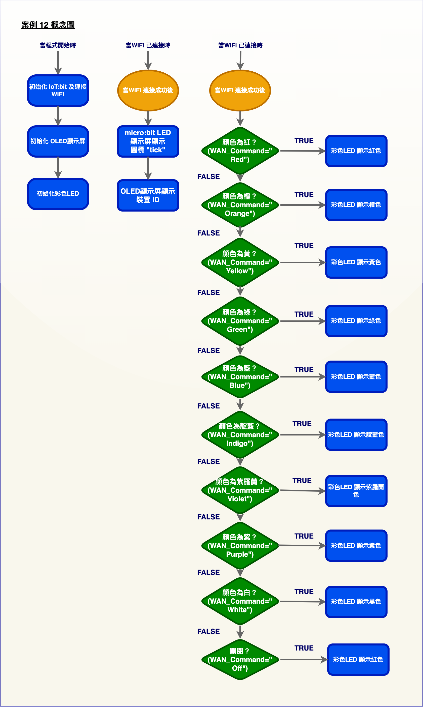
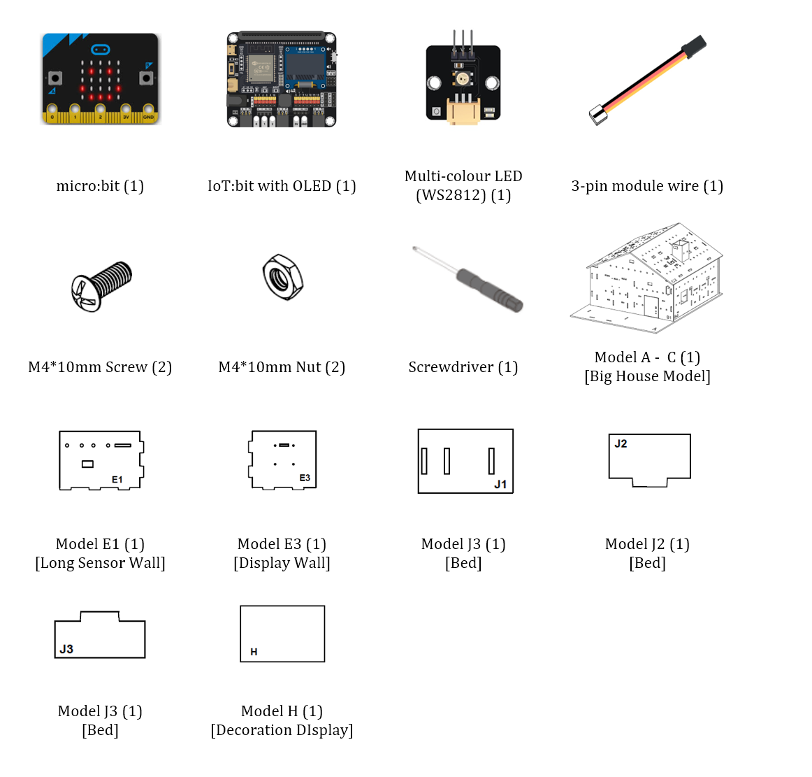
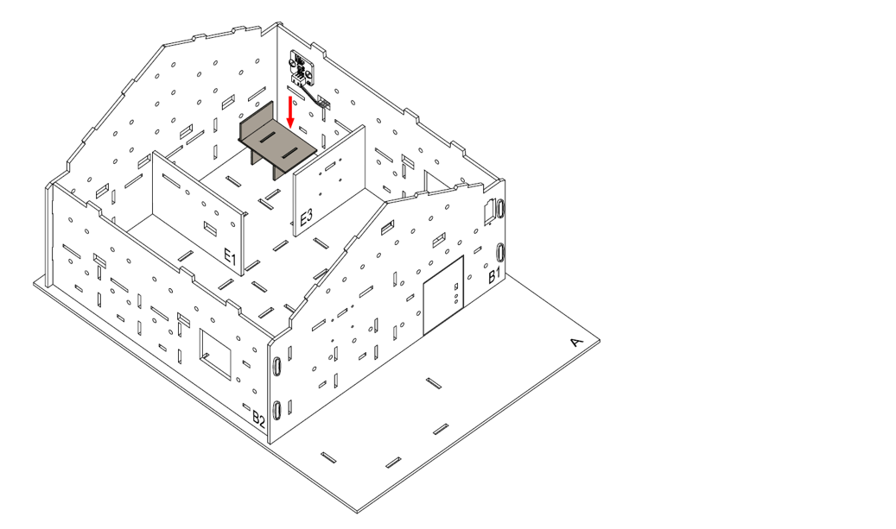
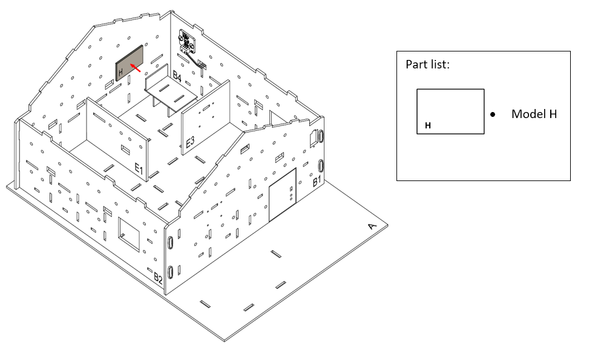
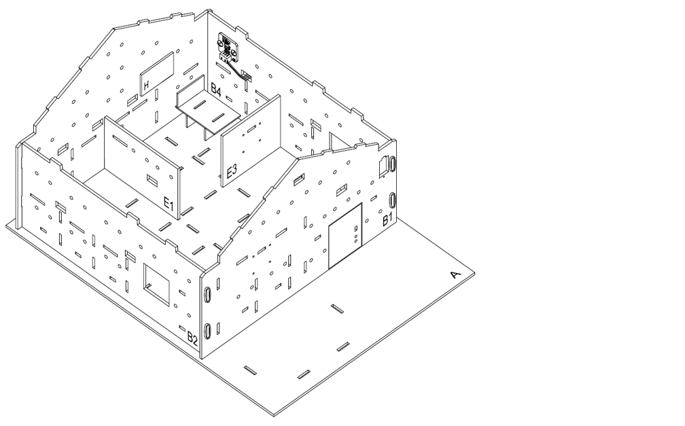
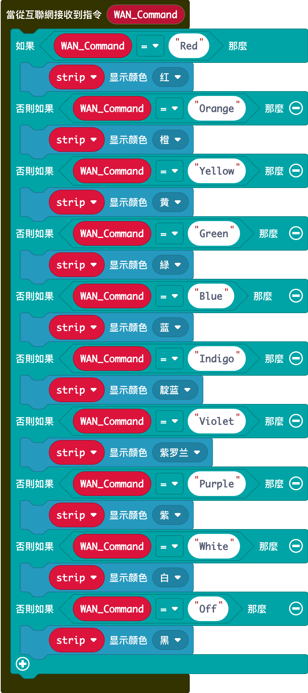
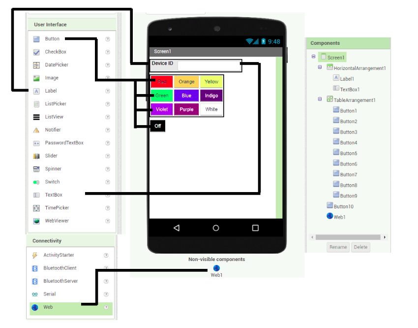
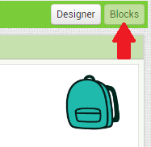
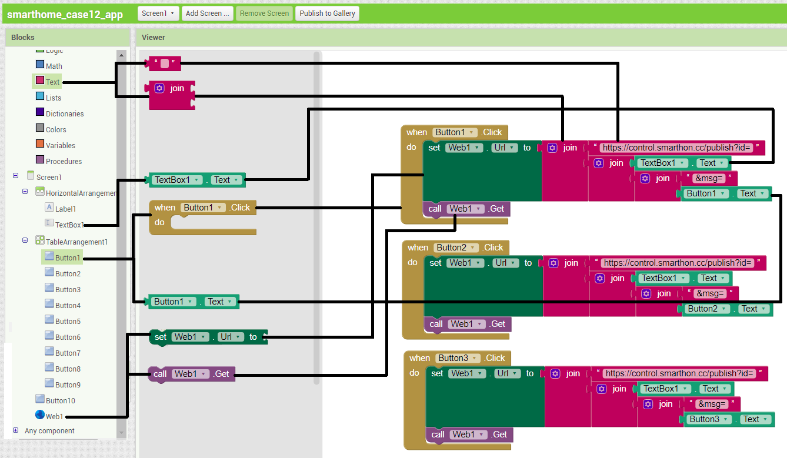

# 物聯網案例 12：智能手機彩色燈泡

難度：

## 目標

製作一個能遙距控制顏色變化的智能手機彩色燈泡。 

## 背景

甚麼是智能手機彩色燈泡？

智能手機彩色燈泡是一個可以以遙控方式（如手機程式）切換顏色的彩色 LED。使用者可以根據需求調整顏色。例如，使用者在睡覺時可能需要較暗的燈光，嬰兒在暖色調的房間會感到舒適，使用者在閱讀時可以選擇合適的燈光顏色。 

運作原理

micro:bit 會連接互聯網以取得裝置 ID。在手機應用程式中，它會向 micro:bit 發送對應不同顏色的命令字眼。在 micro:bit 程式中，當它收到命令時，它會根據命令字眼顯示相應的顏色。 

## 所用部件

## 組裝步驟

步驟一 

這個案例以「大房子模型」作為基礎。 

步驟二 

對準 A、B3 和 B4 模型上的孔，將 E1和 E3 模型組裝到 A 模型上，以建立一個房間。 

步驟三 

用 用 M4*10 毫米螺絲及螺母把彩色 LED 安裝到 B4 模型上，連接線穿過旁邊的孔。 

步驟四 

我們來製作一張床。將 J2 模型組裝到 J1 模型上面，兩個 J3 模型組裝到 J1 模型下面。 

步驟五 

床完成了！ 

步驟六 

將床放到睡房裡。 

步驟七 

把 H 模型裝在 B3 模型上，作為裝飾擺設。 

步驟八 

組裝完成！ 

## 線路連接

1. 連接彩色 LED 到 P0 端口
2. 把蜂鳴器開關向下撥以連接蜂鳴器

## 編程（MakeCode）

步驟一. 初始化OLED、IoT:bit；連接WiFi；啟動彩色LED

* 在`當啟動時`加入`OLED 初始化寬128高64`
* 加入`初始化IoT:bit TX P16 RX P8`
* 加入`連接到 WiFi 名稱 密碼`並輸入 WiFi 名稱和密碼
* 加入`變數 strip 設為引腳 P1 初始化燈帶 1 顆LED（模式 RGB（GRB 順序））`

步驟二. WiFi連線後顯示圖示「勾號」和裝置ID

* 放入一個`當WiFi連接成功後`
* 在裡面加入`顯示圖示勾號`，以在連線後顯示勾號
* 將`當WiFi連接成功後`上的變數`Device_ID`拉到`新行顯示字符串`上

步驟三. 接收命令

* 放入一個`當從互聯網接收到指令`並加入一個巢狀的`如果`語句
* 將第一個條件設為`WAN_Command = Red`
* 在第一個`如果`段中，用`srtip顯示顏色紅`來改變顏色
* 將第二個條件設為`WAN_Command = Orange`
* 在第二個`如果`段中，用`srtip顯示顏色橙`來改變顏色成橙色
* 重複前面的步驟，改成其他顏色，完成每種顏色的設定。

完整答案 

MakeCode: [https://makecode.microbit.org/_UUWE11VHgHdj](https://makecode.microbit.org/_UUWE11VHgHdj) 

你可以從以下網頁中下載HEX檔案： 
<iframe src="https://makecode.microbit.org/#pub:_UUWE11VHgHdj" width="100%" height="500" frameborder="0"></iframe>

## 物聯網（App inventor 2）

步驟一. 建立APP項目

* 在 [http://ai2.appinventor.mit.edu/](http://ai2.appinventor.mit.edu/) 建立一個帳戶
* 新增一個專案

步驟二. 設計APP的介面

* 在畫面編排頁面中，將介面元件從左側拉到編輯器中

* 在此案例中，使用了不同的`按鈕`、`文字輸入盒`、`標籤`和`佈局控制項`
按照您的方式放置元件
* 每個元素都有自己的屬性，你可以隨心所欲地改變它，例如`背景顏色`、`字體大小`、`寬度`、`高度`、`對齊方式`。
* 在此案例中，您需要將`文字`變更為按鈕代表的顏色以獲得與文檔相同的結果。例如，發送「Red」命令的按鈕需要將“紅色”作為`文字`屬性
* 記得將`Web`元素放入編輯器中，它將用於發送指令

步驟三. 對APP中的元件編程

* 點擊右上角按鈕切換到程式設計頁面

* 根據所需功能的類型，在左側找到並放到編輯器
* 進入`ButtonX`元件，找到功能`當ButtonX.被點選`，將其放入編輯器（X代表按鈕的代號）
* 進入`Web1`元件，找到`設Web1.網址為`，放入`當ButtonX.被點選`中
* 進入`文字`目錄，找到元件`合併文字`和`" "`以開始建立控制API
* 控制 API 為：`https://control.smarthon.cc/publish?id=ID&msg=MSG`，其中`ID` 和`MSG` 分別代表`IoT:bit ID`和`指令`
* 需要根據不同的 IoT:bit 和指令來取代 API 中的`ID`和`MSG`
* 使用`TextBox1.文字`取得使用者輸入的`ID`
* 您可以將`MSG`的文字指令直接寫上
* 否則，您也可以使用`ButtonX.文字`取得按鈕的`文字`屬性，用作`MSG`，注意在執行此操作之前需要設定`文字`屬性
* 使用`合併文字`連接各部分的 API
* 完成 API 網址後，使用`Web1`中的`呼叫Web1.執行GET請求`來發送 API 指令

例子

* 完成`Button1`的功能後，請對其他按鈕重複上述步驟，並變更目標按鈕元件（從`Button1`到`Button2`、`Button3`、... )

[AIA](https://raw.githubusercontent.com/SMARTHON/smarthon-docs-en/master/docs/_static/smarthome_case12_app.aia)

[APK](https://raw.githubusercontent.com/SMARTHON/smarthon-docs-en/master/docs/_static/smarthome_case12_app.apk)

## 結果

APP 發送顏色訊息後，燈光顏色會改變。 

## 思考

Q1. 您能想出一個讓彩色燈光變得更智能的建議嗎？（例如會自行決策而不是總是等待指令） 

Q2. 您可以嘗試在應用程式上添加一些按鈕以執行更複雜的操作嗎？ 

