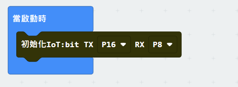
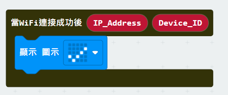

# 就能成功添加 SmartCity 及 WiFi IoT:bit PXT擴展

在使用各種網絡服務像ThingSpeak, IFTTT, 電郵等之前,需要先把Micro:bit與Wifi路由器連接上,這樣才能存取互聯網。 

## 開啟家中的Wifi路由器或是電話上的Wifi熱點

請留意必須使用2.4Ghz頻道的Wifi發射模式,ESP32不支援5Ghz頻道的Wifi連接  
你可以選擇使用家中的Wifi路由器或是由電話Wifi熱點模式所分享的Wifi 

a) 設定你的Wi-Fi路由器所分享的Wifi 

b) 設定你電話熱點分享的Wifi 

* 請先確定你的電話能夠連接互聯網 

Android電話的設定方法: 

iPhone的設定方法: 

## 編程(MakeCode)

第一步驟:初始化IoT:bit 

每次編程時,你需要先初始化IoT:bit才能夠正常使用 
* 前往IoT:bit分頁
* 把「‵初始化IoT:bit TX RX‵」拖動到「‵當啟動時‵」裡面

第二步驟: 連接Wifi 

當你初始化IoT:bit後,你可以開始連接Wifi 
* 前往IoT:bit分頁
* 把「`連接到WiFi 名稱 密碼`」拖動到「`初始化IoT:bit TX RX`」下方
* 輸入你的Wifi名稱以及密碼

第三步驟: 成功連接後以圖案表達 

「`當Wifi連接後`」是一個事件處理器,當你成功連接wifi後,裡面的程式就會被執行。當你成功連接後,會獲得兩個變數,分別為IP地址及裝置ID,利用這兩個變數可以令你輕易地透過網路上控制你的Micro:bit。 
* 拖動「`當Wifi連接後`」到平台上
* 在「`基本`」分頁,拖動「`顯示 圖示`」到「`當Wifi連接後`」裡面
* 把圖示切換成剔 

第四步驟: 顯示你的IP地址 

如果你想知道你的IP地址,你可以把這顯示在顯示屏上 
* 前往「`OLED`」分頁
* 把「`OLED 初始化 寛128 高64`」拖動到「`當啟動時`」裡
* 把「`顯示字符串`」拖動到「`當WiFi連接後`」裡面
* 把「`當WiFi連接後`」裡面的變數「`IP_Address`」拖動到「`顯示字符串`」的輸入格裡
* 你亦可以透過 「`進階->文字`」分頁裡的功能控制顯示的文字格式 

<B><u>額外嘗試</u></B>: 
和「`當Wifi連接後`」接收成功連接Wifi事件一樣,當你的Wifi連線斷開時,亦會觸發另一個事件。這時候你可以用「`當Wifi斷線`」來得知情況及原因,並作出相應的處理,如顯示X圖案及把錯誤碼顯示在顯示屏上 

完整程式 

MakeCode: [https://makecode.microbit.org/_53Yf8qcx521m](https://makecode.microbit.org/_53Yf8qcx521m) 

你亦可以從以下網頁下載程式HEX檔案 
<iframe src="https://makecode.microbit.org/#pub:_53Yf8qcx521m" width="100%" height="500" frameborder="0"></iframe>

## 成果

第一步驟 

把編寫好的程式先上載到Micro:bit,插入IoT:bit後,連接電源並打開開關 
.

第二步驟 

程式會開始執行並嘗試連接Wifi,當成功連接後,會顯示出路由器分派給Micro:bit的IP地址。同時Micro:bit上也會顯示圖案 

若你有在編程時添加好斷線的處理,你亦可以在此測試。當你連接Wifi後,嘗試把路由器關閉以切斷與Micro:bit的連線,這次將會在斷線後顯示X圖案及提示錯誤碼201,這代表「沒找到路由器」(因為我們已關上)。 
斷線的原因通常是: 
1. 距離路由器過遠
2. 沒法找到該路由器
3. 輸入錯誤的名稱或密碼

