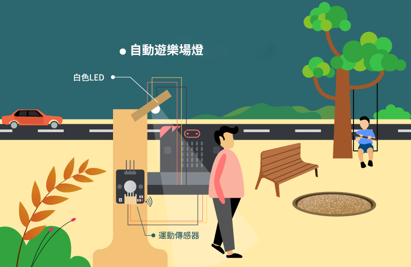
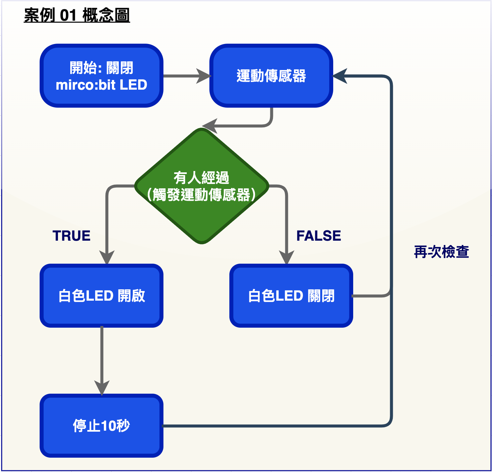
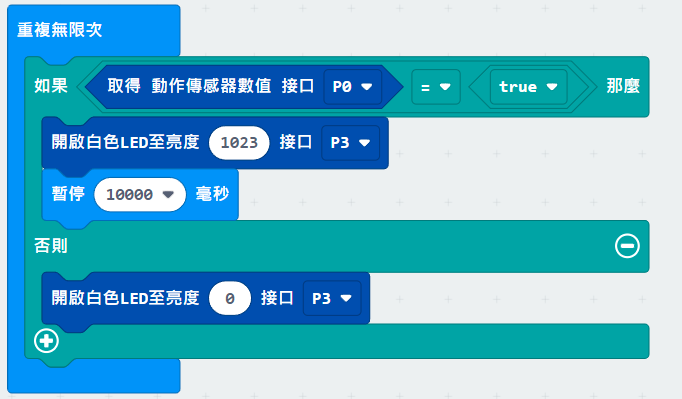

# 案例 01: 自動遊樂場燈

程度: 

## 目標

製作一個能感應附近活動的智能遊樂場燈。

## 背景

甚麼是智能遊樂場燈?

智能遊樂場燈能夠在感應到有人活動時自動開啟，無人時自動關閉，以節省電力。

運作原理

以附上的運動傳感器偵察附近的活動。如果傳感器回報 TRUE，則反映有人在附近，
遊樂場燈會自動開啟，反之亦然。 

在以上邏輯圖可見，整個系統依賴「如果...那麼」邏輯運行。

## 所用部件

## 組裝步驟

步驟一. 

把運動傳感器和白色LED用 M4\*10 毫米螺絲及螺母組裝到A1模型上。 

步驟二. 

組裝完成! 

## 線路連接

* 連接運動傳感器和 IoT:bit 的 P0 端口 

* 連接白色LED和IoT:bit 的 P3 端口 

 

注意: 

>1.根據顏色連接接線和端口 
>2.P0 內建線路予蜂鳴器。在使用 P0 端口予其他外接設備時遇上問題，建議查
看位於 IoT:bit 右上的蜂鳴器開關狀態

## 編程 (MakeCode)

步驟一. 關閉 micro:bit 上的內建 LED 

* 在「燈光」模組裏尋找啟用設為”FALSE”並加入至「在啟動時」 
* 因為P3預設是用於控制Micro:bit的LED，所以需先關閉

步驟二. 以運動傳感器激活白色LED  
 
* 加入「重復無限次」至主程式
* 插入「如果...那麼」
* 將”取得運動傳感器接口 P0 == TRUE”設為條件，用來進行其後的判斷
* 加入”開啟白色 LED 至亮度 1023 接口 P3”和”等待 10 秒”至「如果」區域，這段程序將會在”取得運動傳感器接口 P0 == TRUE”為正確時運行
* 加入”開啟白色 LED 至亮度 0 接口 P3”至「否則」區域， 這段程序將會在”取得運動傳感器接口 P0 == TRUE”為錯誤時運行

完整答案 

MakeCode: [https://makecode.microbit.org/_UM2VU1AFoiYt](https://makecode.microbit.org/_UM2VU1AFoiYt) 

你可以從以下網頁中下載HEX檔案 
<iframe src="https://makecode.microbit.org/#pub:_UM2VU1AFoiYt" width="100%" height="500" frameborder="0"></iframe>

## 結果

如果有人在旁邊移動，運動傳感器將會被觸發。這時候程式就會依照傳感器的狀態決定開燈或是關燈。 

## 思考

 

Q1. 除了自動遊樂場燈外，還可以怎使用運動傳感器? 

<!---
Q2. How should we reset the programming if we connect the white LED light to P3? 

Tips: As P3 is used by micro:bit LED. 
(Refer to [https://makecode.microbit.org/device/pins](https://makecode.microbit.org/device/pins)) 
If we connect white LED light to P3， we need to disable micrbo:bit LED. 

-->

Q2. 你能夠在OLED顯示屏上顯示運動傳感器的狀況嗎?

