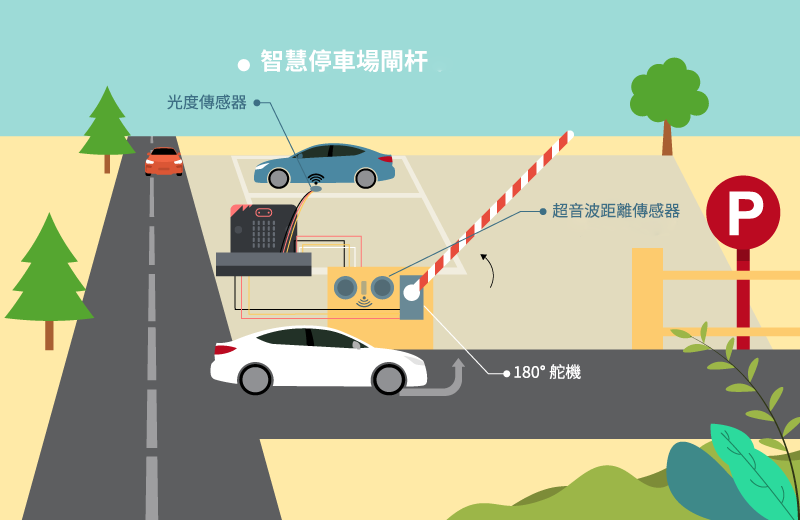
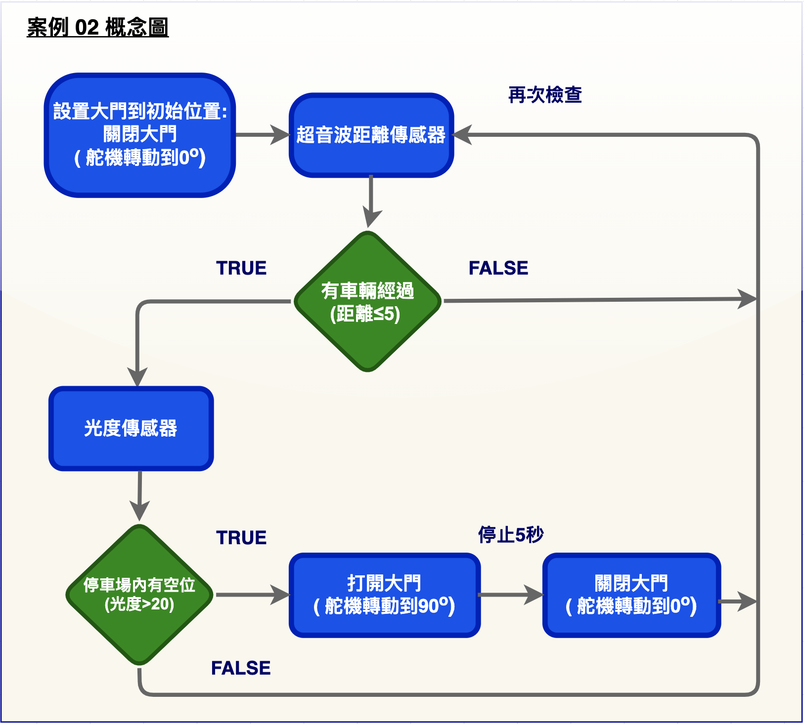
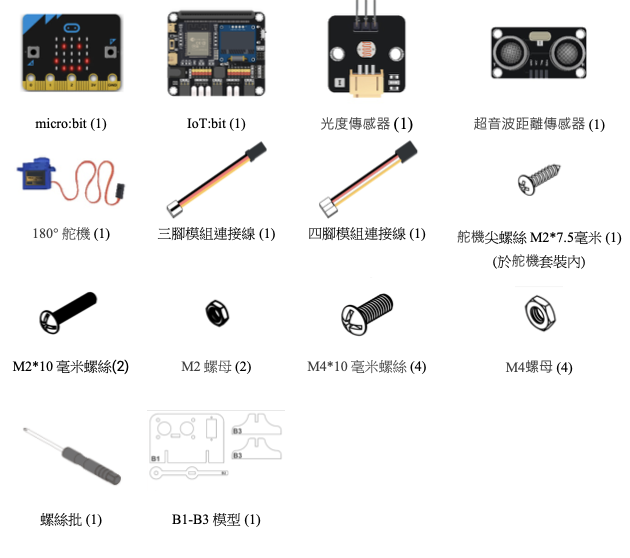
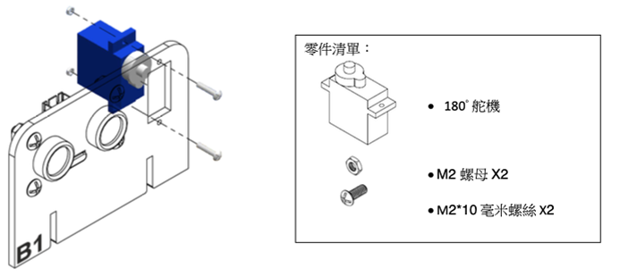
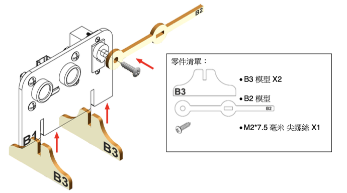
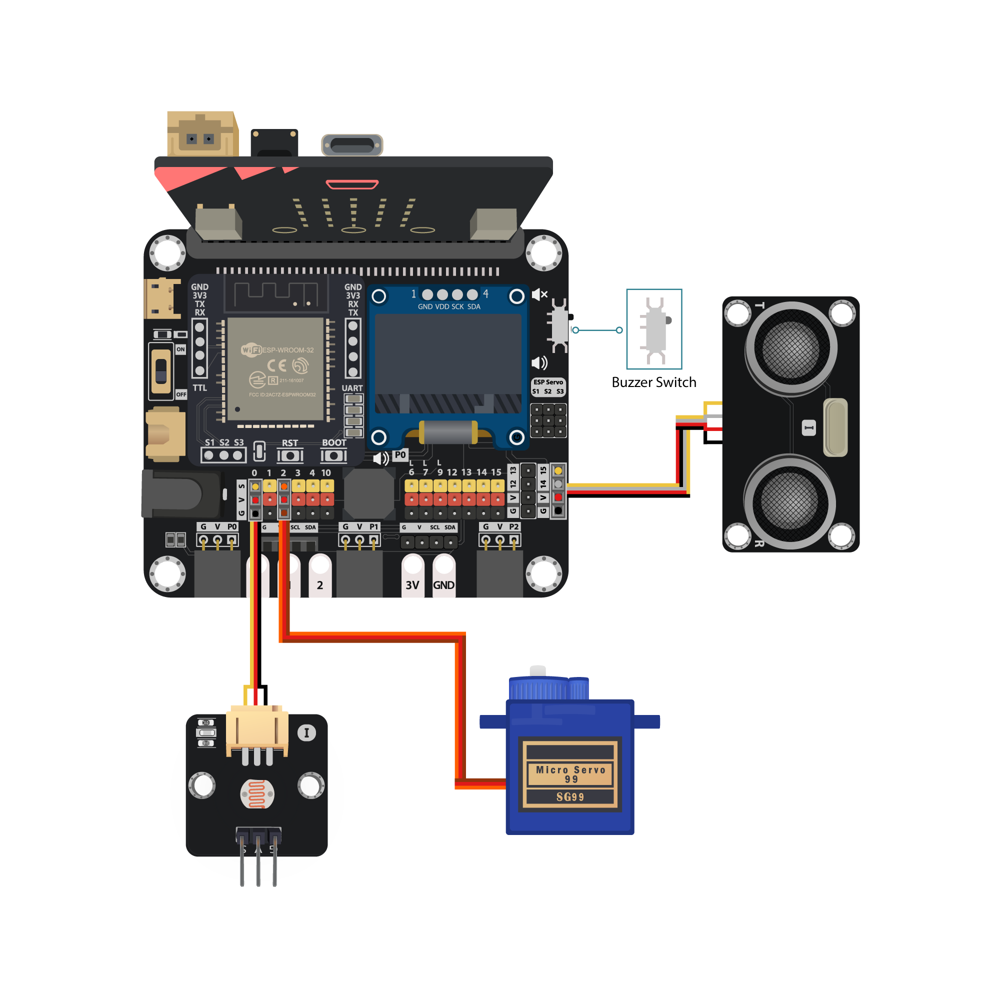
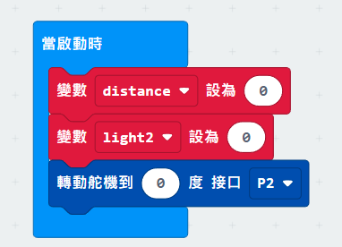
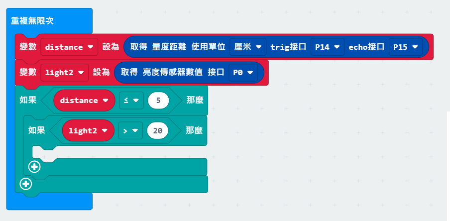
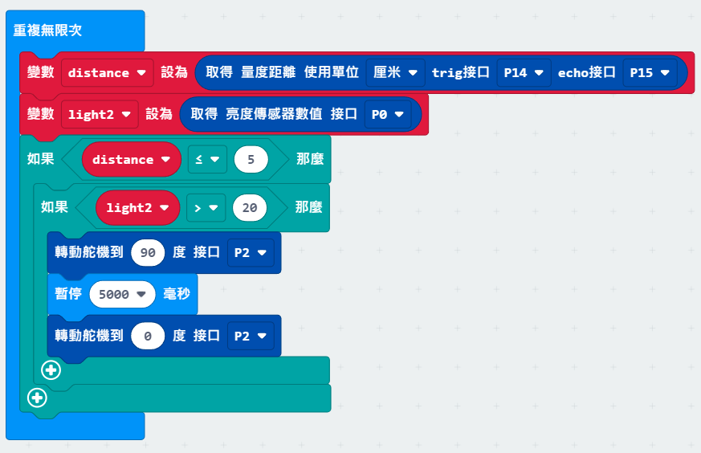

# 案例 02: 智慧停車場閘門

程度: 

## 目標

製作一個會根據停車場內車位狀況和是否有來車自動開閉閘門的智慧停車場閘門。 

## 背景

甚麼是智慧停車場閘門?

智慧停車場能為人們帶來便利。通過自動偵測停車場內車位狀況，它能夠節省司機等
候閘門開啟和尋找車位的時間。 

運作原理

180 度舵機控制閘門的開關。如果停車場內尚有空位，閘門會在有車駛近時自動開啟。若然已無車位，即使有車到訪，閘門也不會開啟。 

從上述示意圖可見，在「重復無限次」裡會一直檢測到訪車輛和場內空位。

## 所用部件

## 組裝步驟

步驟一 

用 M4”10 毫米螺絲螺母把距離傳感器裝到 B1 卡板上。  

步驟二 

用 M2”10 毫米螺絲螺母把 180 度舵機組裝到 B1 卡板上。 

步驟三 

用 舵機用M2”7.5毫米尖頭螺絲 把 B2 卡板連上舵機。 把 B3 卡板放在
B1 卡板下。 

步驟四 

組裝完成! 

## 線路連接

連接運動傳感器和 IoT:bit 上的 P14(trig)/P15(echo) 端口 

連接光傳感器和 IoT:bit 上的 P0 端口 

連接 180 度舵機和 IoT:bit 上的 P2 端口 

*注意 

>1.根據顏色連接接線和端口
>2.P0 內建線路予蜂鳴器。在使用 P0 端口予其他外接設備時遇上問題，建議查
看位於 IoT:bit 右上的蜂鳴器開關狀態

## 編程 (MakeCode)

步驟一. 定義新變數和舵機起始位置 

* 定義新變數”distance”和”light2”
* 在「當啟動時」裡設”distance” 和”light2” 數值為 0，”轉動舵機到 0 度 接口 P2”

步驟二. 讀取距離和光強度數值 

* 在「重復無限次」把”distance”變數設為 “取得量度距離使用單位厘米 trig 接口 P14echo 接口 P15”

* 把”light2”變數設為”取得亮度傳感器數值接口P0”

步驟三. 以光強度值決定開閘與否 

* 在「重復無限次」加入”如果...那麼”，前提設為”distance ≤ 5”
* 在上述邏輯內再加一個”如果...那麼”，前提設為”light2 > 20”

步驟四. 設定舵機位置 

* 在”light2 > 20”內加入” 轉動舵機到 90 度接口 P2”
* 等待 5 秒
* 轉動舵機到 0 度接口 P2

*注意

>1.如果舵機轉動角度/方向與程式不符，重設舵機至 0 度再嘗試 
>2.如果遭遇錯誤，嘗試分開測試光傳感器和距離傳感器並決定讀數是否正確。 
>3.查看接線是否正確 

完整答案 

MakeCode: [https://makecode.microbit.org/_UgRKmX2XzH2u](https://makecode.microbit.org/_UgRKmX2XzH2u) 

你可以在以下網頁中下載HEX檔案: 
<iframe src="https://makecode.microbit.org/#pub:_UgRKmX2XzH2u" width="100%" height="500" frameborder="0"></iframe>

## 結果

透過光度傳感器，成功得知有沒有空缺的車位。當車經過超聲波距離傳感器時，因應車位的空缺狀況就能控制180度舵機轉動來打開車閘5秒，讓車輛駛進停車場。 

## 思考

Q1. 你可以怎麼在 OLED 顯示屏上顯示光和距離讀數? 

Q2. 試在 Micro:bit的LED陣列上顯示停車場內狀況。 

