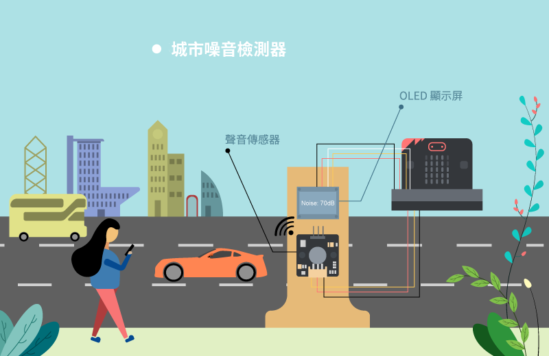
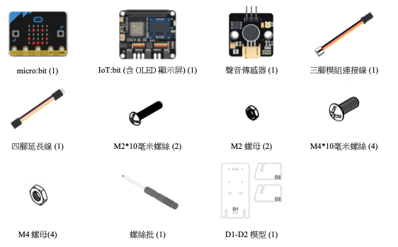
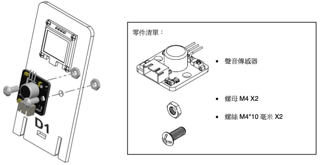
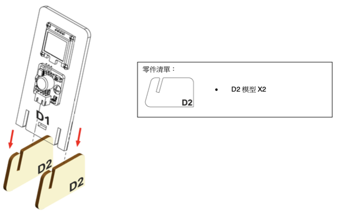
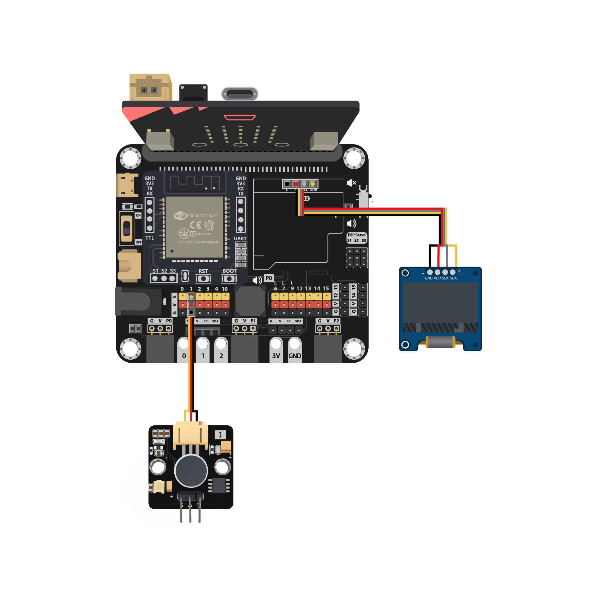
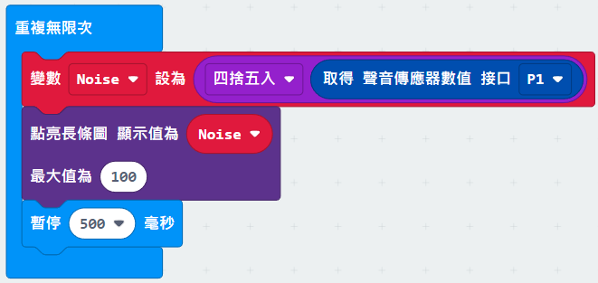
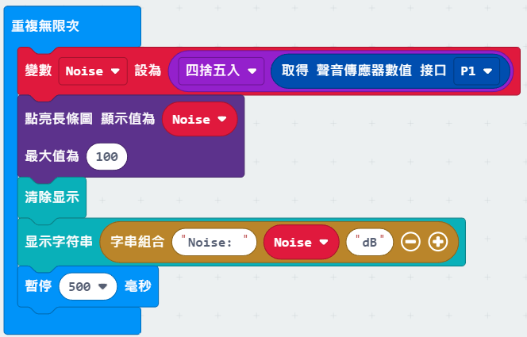

# 案例 04: 智能都市噪音監控

程度: 

## 目標

製作一個能夠偵查路邊噪音的監測點。 

## 背景

甚麼是都市噪音監測?

都市噪音監測系統監測公路上的噪音污染,因為過大的噪音會降低周遭人們的生活水
平。安裝一個系統可以幫助工程師收集有關數據用於城市規劃。 

運作原理

噪音傳感器可以偵測公路上的噪音水平,數據可以以圖表形式顯然。 

## 所用部件

## 組裝步驟

步驟一

用 M2”10 毫米螺絲螺母把 OLED 組裝至 D1 卡板。 

步驟二

用 M4”10 毫米螺絲螺母把噪音乓 感器組裝至 D1 卡板。 

步驟三

組裝 D1 和 D2。 

步驟四

組裝完成! 

## 線路連接

連接噪音傳感器和 IoT:bit 的 P1 端口 

把 OLED 接到 I2C 端口 

## 編程(MakeCode)

步驟一. 啟動 OLED 顯示屏和宣告新變數

* 初始化 OLED (128闊64高)
* 宣告變數”Noise”並設值為 0

步驟二. 在 OLED 上顯示噪音數值

* 在「重復無限次」加入”變數 Noise 設為四捨五入取得聲音傳感感器數值接口 P1
* 在「燈光」模塊中加入點亮長條圖顯示值為 Noise, 最大值為 100
* 等待 0.5 毫秒

步驟三. 在 OLED 上顯示噪音數值

* 加入”清除顯示”
* 加入”新行顯示字符(字申組合(“Noise: ‵Noise‵ dB”))”

完整答案 

MakeCode: [https://makecode.microbit.org/_TiW9H7CuU5M5](https://makecode.microbit.org/_TiW9H7CuU5M5) 

你可以在以下網頁下載HEX檔案: 
<iframe src="https://makecode.microbit.org/#pub:_TiW9H7CuU5M5" width="100%" height="500" frameborder="0"></iframe>

## 結果

在初始化 IoT:bit 和 OLED 後,將會顯示噪音的圖表。 

## 思考

Q1. 當噪音太大可以如何發出提示? 

