# 物聯網案例 08: 智能交通燈

程度: 

* 詳情參考 附錄:點對點通訊 
* 本案例分為兩部分:發送者及接收者。要完成這案例，需要兩套組裝。
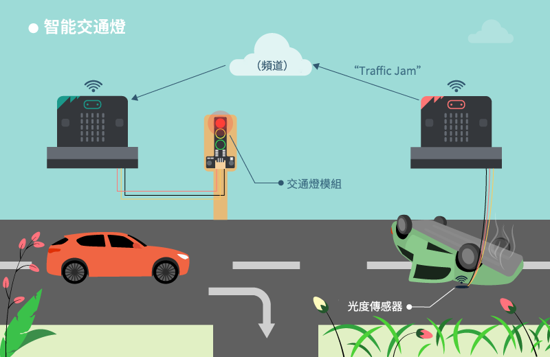

## 發送者

### 目標

製作一個可以向其他設備反映該地區有沒有塞車的系統。 

### 背景

如何向其他 micro:bit 傳送訊號?

發送者和接收者連接至同一個頻道，容許 WiFi 訊號在之間傳遞。當發送者發出”trafficjam”，接收者會因應訊號作出反應。 

發出者運作原理

當光度傳感器長期回饋過低數值，這代表有車停在此處，即公路上有塞車發生。發送者傳送”trafficjam”至 microbit。反之則發送”nojam”。 

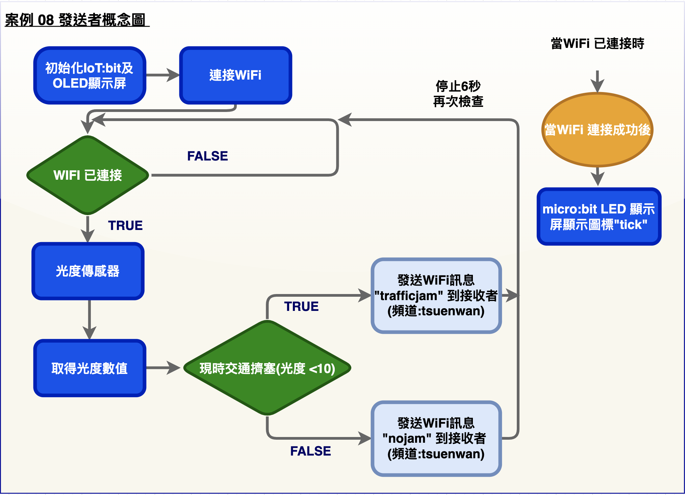

### 所有部件

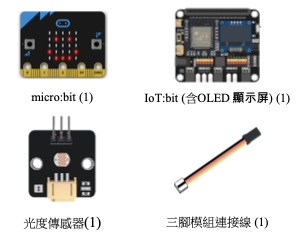

### 線路連接

* 連接光度傳感器和 IoT:bit 的 P0 端口。 

*注意

>1. 根據顏色連接接線和端口 
>2. P0 內建線路予揚聲器。在使用 P0 端口予其他外接設備時遇上問題，建議查看位於 IoT:bit 右上的揚聲器開關狀態

### 編程 (MakeCode)

步驟一. 啟動 OLED，IoT:bit 和連接至 WiFi

* 啟動 OLED，IoT:bit 和連接至 WiFi
* 宣告新變數`light2`並設值為 0 
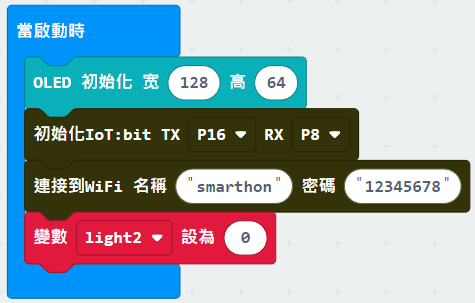

步驟二. 在連接至 WiFi 後顯示剔號

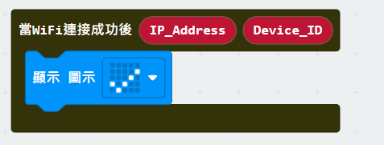

步驟三. 檢查交通狀況

* 在「重復無限次」加入”如果...那麼”並以`WiFi connected?`為前設
* 設`light2` 為`取得光傳感器數值接口 P0`
* 清除顯示
* 新行顯示”字串組合 Light: `light2`”
* 等待 6 秒
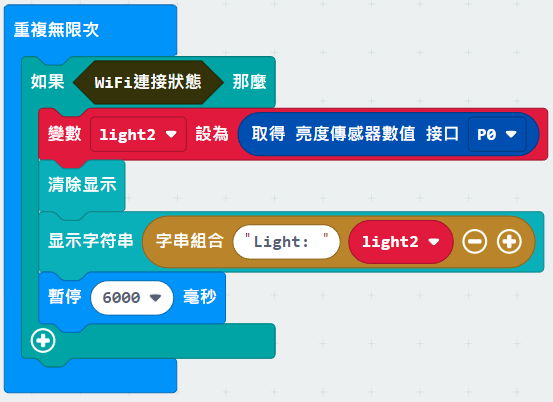

步驟四. 當交通擠塞發出提示

* 在邏輯內加入新”如果...那麼”，以”ligh12 < 10”為前設
* 在 "如果...那麼" 裡面添加 `Wifi Sender send Channel`的訊息，分別依照交通情況來傳送 'trafficjam' 或 'nojam' 

完整答案 

MakeCode: [https://makecode.microbit.org/_DDHataUJ04HY](https://makecode.microbit.org/_DDHataUJ04HY) 

你可以在以下網頁下載HEX檔案 
<iframe src="https://makecode.microbit.org/#pub:_DDHataUJ04HY" width="100%" height="500" frameborder="0"></iframe>

### 結果

光度傳感器用以偵測有沒有出現塞車。當光度正常， "nojam" 會被送出。 

當光度過低， "trafficjam" 會被送出。 

### 思考

Q1. 我們可以用超音波距離傳感器偵測有否塞車嗎? 

## 接收者

### 目標

製作一個能接收訊號並控制交通燈的交通系統。 

### 背景

如何接收另一個 micro:bit 的訊號?

讓發送者和接收者連接至同一個頻道。然後讀取訊息。 

接收者運作原理

當收到”trafficjam”訊號，代表有塞車狀況出現。交通燈會轉為紅色。反之則會維持綠色。 

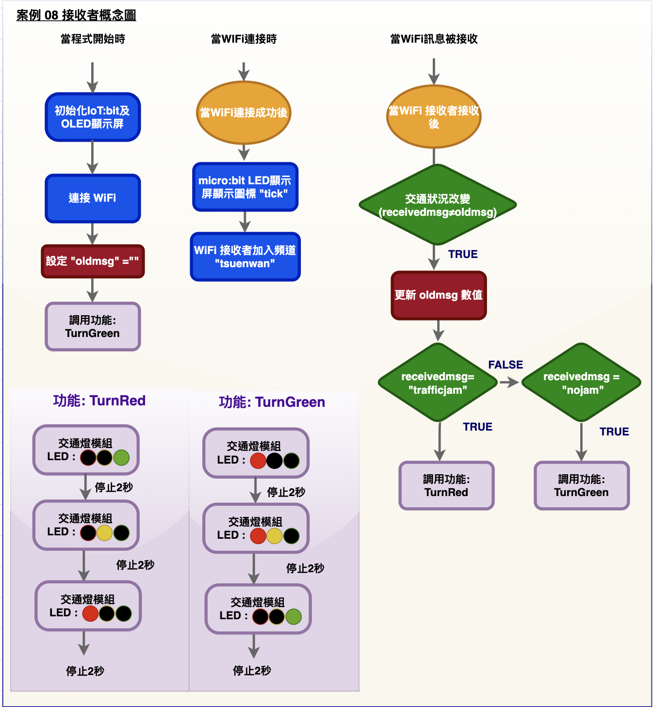

### 所用物資

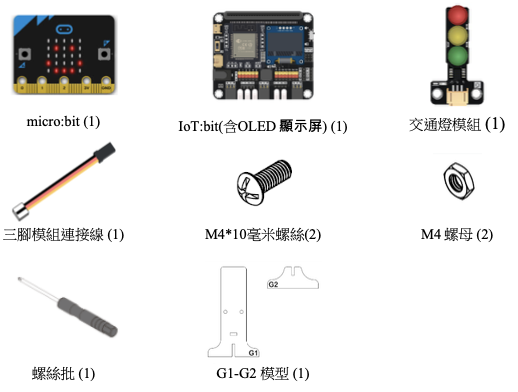

### 組裝步驟

步驟一

用 M4\*10毫米螺絲及螺母把交通燈組裝到 G1 模型上。組裝 G1 和 G2。 

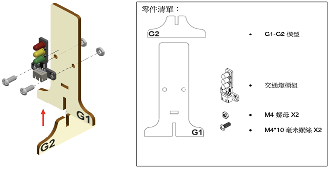

步驟二

組裝完成! 

### 線路連接

* 連接交通燈和 IoT:bit 的 P0 端口 

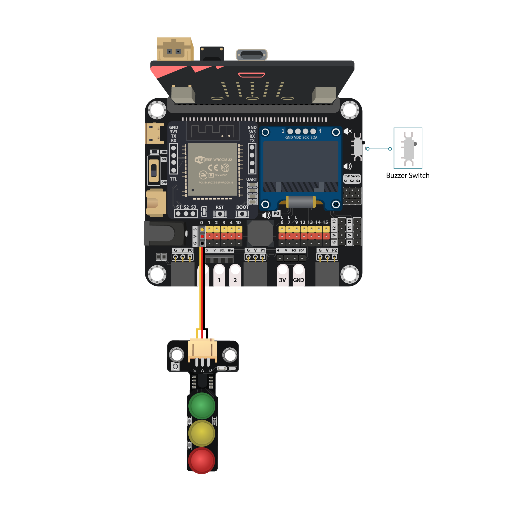

*注意:

>1. 根據顏色連接接線和端口 
>2. P0 內建線路予揚聲器。在使用 P0 端口予其他外接設備時遇上問題，建議查
看位於 IoT:bit 右上的揚聲器開關狀態

### 編程 (MakeCode)

步驟一. 啟動 OLED，IoT:bit 皚連接至 WiFi

* 啟動 OLED，IoT:bit 和連接至 WiFi
* 宣告新變數`oldmsg`為” “。

步驟二. 加入”tsuenwan”頻道

* 在`on WiFi connected`加入剔號和`WiFi Receiver join channel tsuenwan`
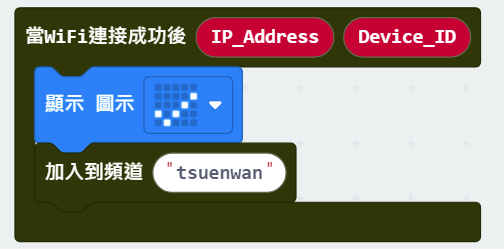

步驟三. 接收 WiFi 訊息

* 在”On WiFi Receiver received”加入清除顯示
* 新行顯示 ”字串組合”訊息: `receivedmessage`”""

 
步驟四. 宣告新函式(TurnRed)

* 在`TurnRed`函式中加入`Control traffic light at P1`
* 等待兩秒
* 轉顏色為黃色，等待兩秒
* 轉顏色為紅，等待兩秒

步驟五. 宣告新函式(TurnGreen)

* 在`TurnGreen`函式中加入”Control traffic light at P1”
* 轉為紅色，等待兩秒
* 轉為黃色，等待兩秒
* 轉為綠色，等待兩秒

步驟六. 設定交通燈初始狀態

* 在「當啟動時」加入`TurnGreen`
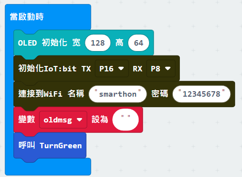

步驟七. 轉變交通燈狀態

* 在`On WiFi Receiver received`加入”如果...那麼”
* “receivedMessage ≠ oldmsg”為前設
* 設”oldmsg” = receivedMessage
* 在邏輯裏加入”如果...那麼”，”receivedMessage = trafficjam”為前設
* 呼叫`TurnRed`
* 將“receivedMessage = nojam”設為否則前設
* 在否則內呼叫`TurnGreen`
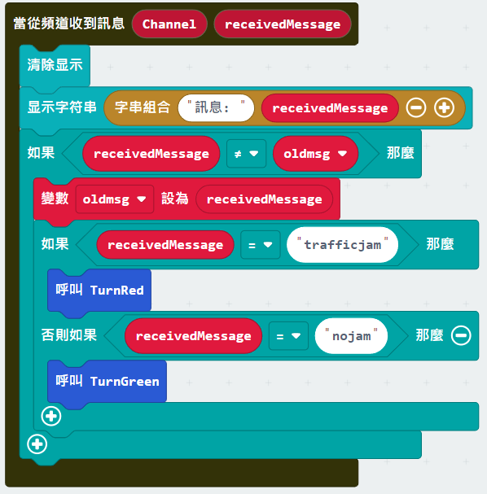

完整答案 

MakeCode: [https://makecode.microbit.org/_K5eKdP1hMcdj](https://makecode.microbit.org/_K5eKdP1hMcdj) 

你可以在以下網頁下載HEX檔案: 
<iframe src="https://makecode.microbit.org/#pub:_K5eKdP1hMcdj" width="100%" height="500" frameborder="0"></iframe>

### 結果

交通燈會根據 WiFi 訊息轉變顏色。 
* 如接收到”nojam”，燈會轉綠。 
* 如接收到”trafficjam”，燈會轉紅。 
 

### 思考

Q1. 試就顏色添加音效? 

Q2. 如果我們不加入邏輯檢查新舊訊息，會發生甚麼? 