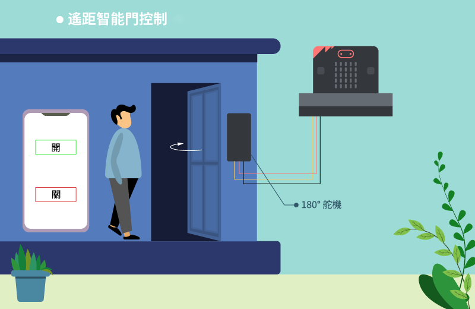
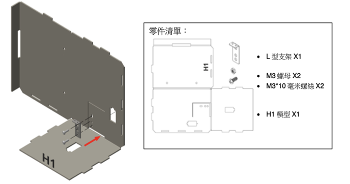
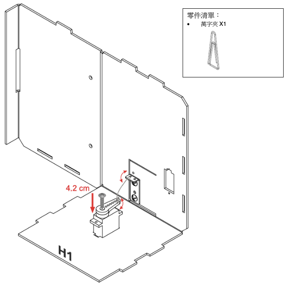
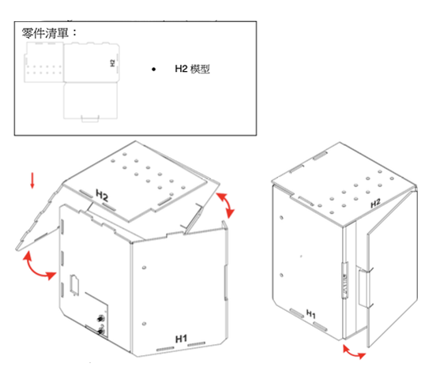
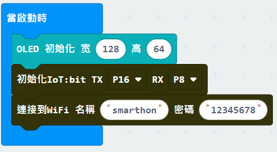
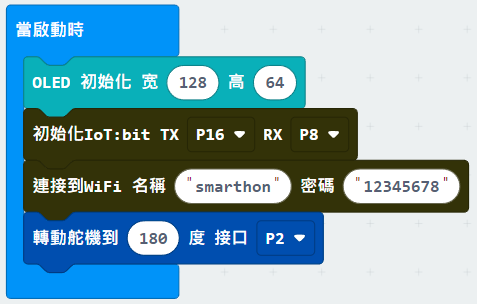
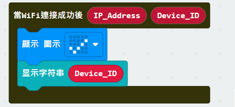
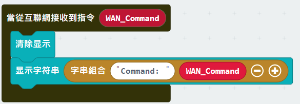
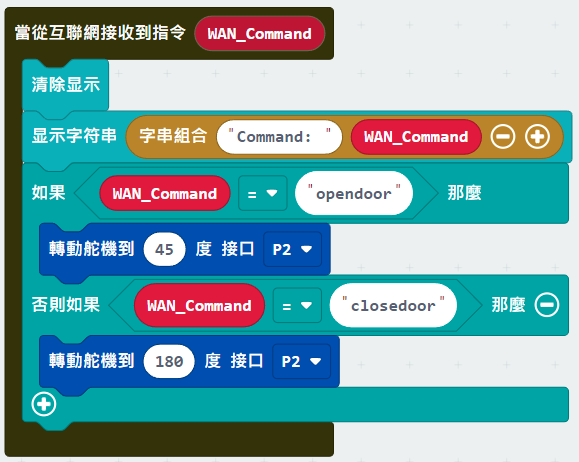

# 案例 09: 智能屋門控制

程度: 

## 目標

用 App Inventor 製作一個能遙控開關門的應用程式。  

## 背景

甚麼是 app inventor? 

這是一個能讓用家自行開發程式的工具。 

智能門控制原理 

當 microbit 收到”opendoor”訊號,舵機會自動轉動。當收到”closedoor”,門會自動關閉。 

## 所用部件

## 組裝步驟

步驟一 

用 M4 螺絲螺母把 L-字卡板組裝到 H1 卡板上。 

步驟二 

把舵機組裝到 H1 卡板。 

步驟三 

把萬字夾剪到 4.2 厘米,並用於固定 L-字卡板。 

步驟四 

組裝所有卡板。 

步驟五 

組裝完成! 

## 線路連接

連接舵機和 IoT:bit 的 P2 端口 

Micro:bit P2|舵機
-:-|-:-
S (黃)|S (橙)
V (紅)|V (紅)
G (黑)|G (棕)

## 編程 (MakeCode)

步驟一. 啟動 OLED,Iot:bit 和連接至 WiFi

步驟二. 設定舵機初始位置 

* 加入`turn servo to 180 degree at P2`

步驟三. 在連接至 WiFi 後顯示剔號及ID 

步驟四. 接收 WAN 指令 

* 在`On WiFI received`加入清除顯示
* 新行顯示` "字串組合"Command” WAN_Command” `

步驟五. 以 WAN 指令開關門 

* 如接收到”opendoor”,舵機轉向 45 度
* 如接收到”closedoor”,舵機轉向 180 度

完整答案 

MakeCode: [https://makecode.microbit.org/_YhvAsP3HCgY6](https://makecode.microbit.org/_YhvAsP3HCgY6) 

你可以在以下網頁下載HEX檔案: 
<iframe src="https://makecode.microbit.org/#pub:_YhvAsP3HCgY6" width="100%" height="500" frameborder="0"></iframe>

 
## IoT (App Inventor)

*詳情參考”附錄..App Inventor 2* 

步驟一 

創建新頁面 

* On Designer:
* 在左邊界面拖出元素 
* 把”Web”拖到最下面

步驟二 

編程
* On Blocks: 
* The WAN control command URL is: 
[http://control.smarthon.cc/publish?id=DeviceID&msg=ControlCommand](http://control.smarthon.cc/publish?id=DeviceID&msg=ControlCommand)

* 當 button1 被點撃,以下指令會被執行

* 當 button2 被點撃,以下指令會被執行

* 下載程式至手機

 
## 結果
在框內輸入 device ID,點選”opendoor”或”clodedoor” 

 

透過App Inventor,可以很輕易地控制門的開關 

## 思考

Q1. 能否增加密碼驗證才開門? 

Q2. 舵機還能在智能家居的什麼地方應用? 

