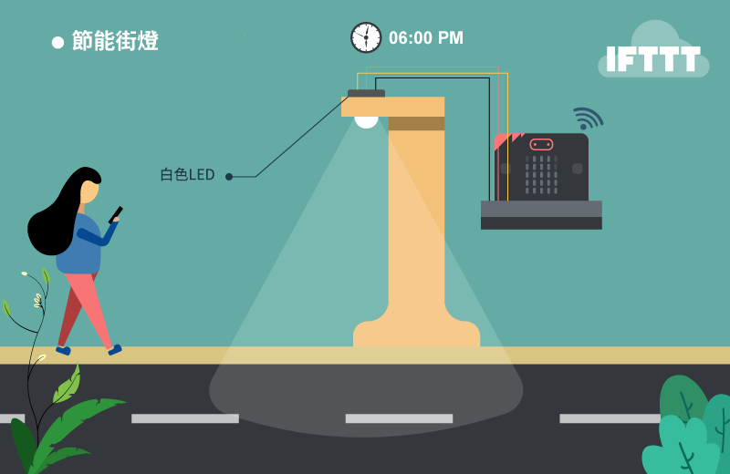
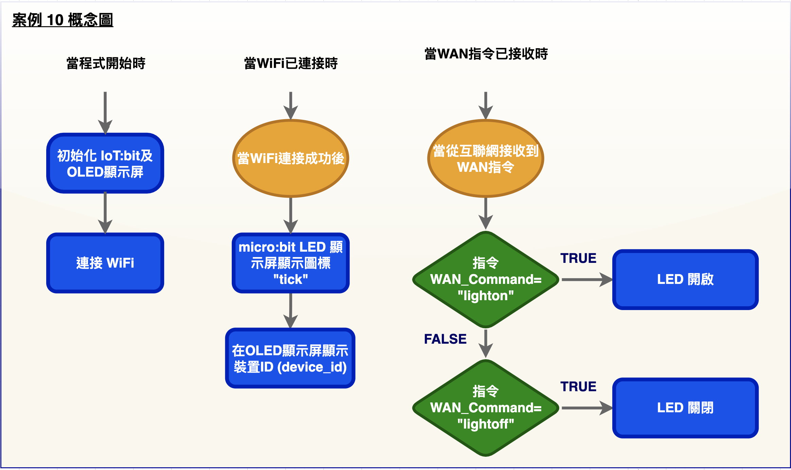
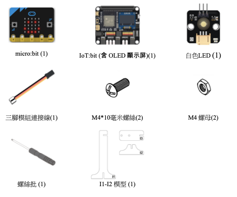
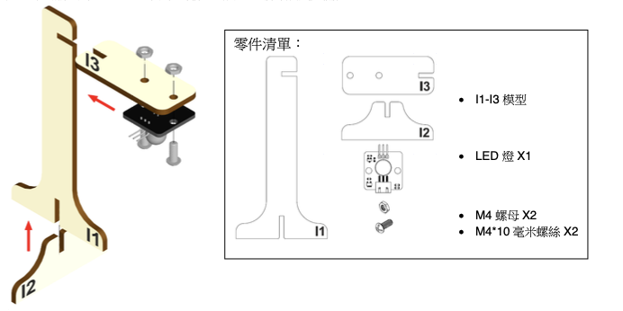
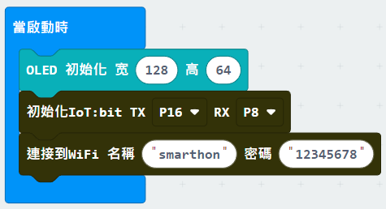
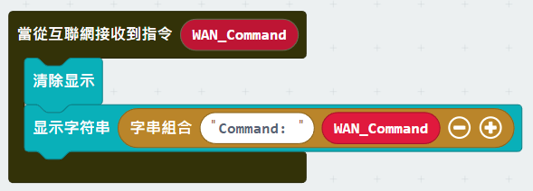
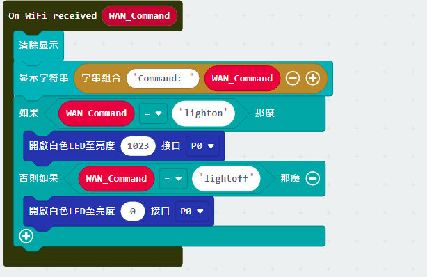

# 案例 10: 智能街燈

程度: 

## 目標

製作一個能以指令開關的街燈 

## 背景

甚麼是智能街燈? 

智能街燈是可以在指定時間自動開關的街燈,能夠同時兼顧節省能源及照明需求。 

運作原理 

當從 WAN 收到指令,micro:bit 會根據指令控制街燈。所以只需要在不同時間及場合發送指令即可。 

## 所用部件

## 組裝步驟

步驟一 

用 M4 螺絲螺母把 LED 組裝到 I2 卡板上。組裝 I1 至 I3 卡板。 

步驟二 

組裝完成 

## 線路連接

* 連接 LED 和 IoT:bit 的 P1 端口 

*注意:*

>1. 根據顏色連接接線和端口 
>2. P0 內建線路予蜂鳴器。在使用 P0 端口予其他外接設備時遇上問題,建
議查看位於 IoT:bit 右上的蜂鳴器開關狀態

## 編程 (MakeCode)

步驟一. 啟動 OLED,Iot:bit 和連接至 WiFi 

步驟二 1. 在連接至 WiFi 後顯示剔號及ID 

步驟三. 接收 WAN 指令 

* 把接收到的指令顯示出來

步驟四. 控制 LED 開關 

* 加入”如果...那麼”
* ”WAN_Command = lighton”設為第一個條件
* 在 "如果" 裏加入`turn white LED to 1023 at P1`
* 點擊加號,在那添加第二個條件”WAN_Command = lightoff”
* 在第二個 "如果" 裏加入`turn white LED to 0 at P1`

完整答案 

MakeCode: [https://makecode.microbit.org/_2cRf6LWq69AL](https://makecode.microbit.org/_2cRf6LWq69AL) 

你可以在以下網頁下載HEX檔案: 
<iframe src="https://makecode.microbit.org/#pub:_2cRf6LWq69AL" width="100%" height="500" frameborder="0"></iframe>

## IoT (IFTTT)

* 詳情參考 "附錄:IFTTT"  
本案例一共需要兩個專案 *
 

步驟一. 在 IFTTT 開立新專案 

步驟二. 選擇”Date & Time” 為 IF THIS 

步驟三。 選擇時間間隔,時區,時間為上午6時 

步驟四。 選擇 Smarthon IoT:bit 為 Then That 

步驟五。 選擇指令 
	
步驟六。 輸入指令和 Device ID後儲存 

步驟七。 重複以上動作,時間設為下午6時 

## 結果

在IFTTT平台上會在每天早晚6時發送訊號,因此LED會在每天早晚6時開關。 

## 思考

Q1. 除了時間之外,IFTTT能否用其他條件觸發?
