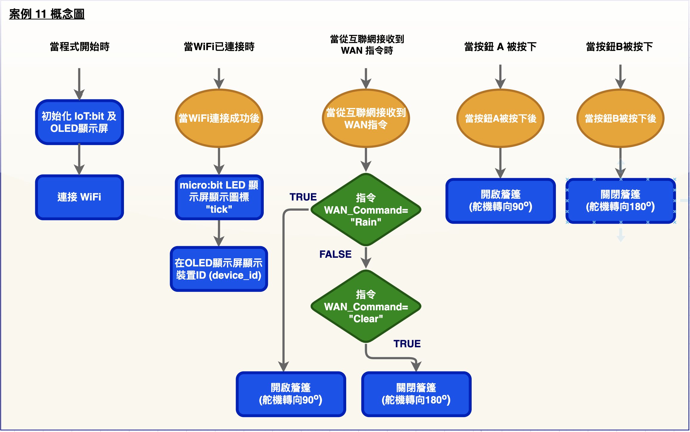
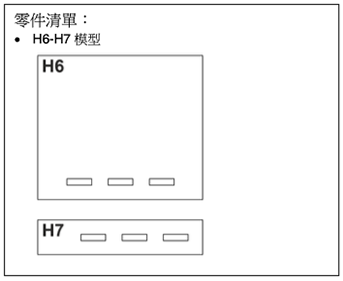
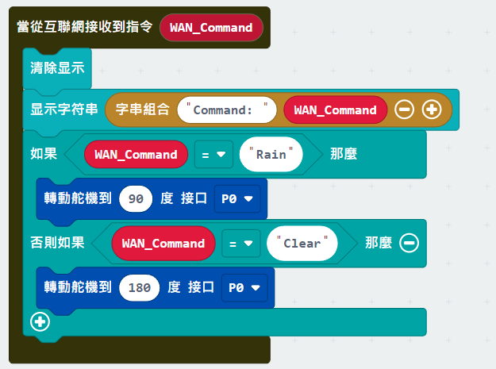
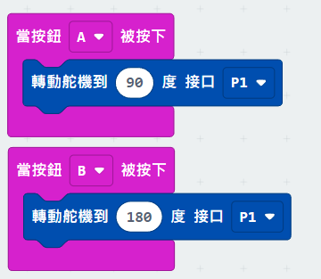

# 案例 11: 自動天台布架

程度: 

## 目標

製作一個會在天氣改變時自動開關的布架,避免衣物被雨水沾濕。

## 背景

為什麼我們需要自動布架? 

這樣當下雨時人們再不需要衝上天台把衣服收回。 

運作原理 

Micro:bit通過IFTTT平台上的天氣預報系統,取得指令內容開關布架。 

## 所用部件

 
## 組裝步驟

步驟一 

把雨滴傳感器組裝至 H2 卡板。 

步驟二 

把 H1 和 H3 卡板組裝。 

步驟三 

組裝所有卡板。 

步驟四 

用 M2 螺絲把舵機組裝到 H5 卡板。   

步驟五 

組裝 H4-H5 和 H6-H7 

步驟六 

組裝完成! 

## 線路連接

連接180度舵機和 IoT:bit 的 P1 端口 

Micro:bit P1|舵機
:-: | :-: 
S (黃) |S (橙)
V (紅)	| V (紅)
G (黑) | G (棕)

## 編程 (MakeCode)

步驟一. 啟動 OLED,IoT:bit 和連接 WiFi 

步驟二. 在連接 WiFi 後顯示剔號及ID 

步驟三. 接收指令 

* 每次接收時都先清除顯示
* 把接收到的拍令用顯示字串 "Command: WAN_Command" 顯示出來

步驟四. 以指令控制開關 

* 加入 ”如果...那麼” ,以 ”WAN_Command = Rain” 為條件
* 在第一個 "那麼" 裡添加`Turn Servo to 90 degree at P1`
* 點擊加號,以”WAN_Command = Clear” 為第二條件
* 在第二個 "那麼" 裡添加`Turn Servo to 180 degree at P1`

步驟五. 按 A 以開啟布架 

* 當按A按鈕時,轉動舵機

步驟六. 按 B 以開啟布架 

* 當按B按鈕時,向另一角度轉動舵機

完整答案 

MakeCode: [https://makecode.microbit.org/_6KyfVPJEd10A](https://makecode.microbit.org/_6KyfVPJEd10A) 

你可以在以下網頁下載HEX檔案: 
<iframe src="https://makecode.microbit.org/#pub:_6KyfVPJEd10A" width="100%" height="500" frameborder="0"></iframe>

## IoT (IFTTT)

* 詳情參考 附錄:IFTTT 

步驟一. 創建新專案(共需要兩個專案),選擇 weather underground 

步驟二. 選擇”Current condition changes to” 

步驟三. 選擇地點和觸發條件 

步驟四. 選擇 Snarthon IoT:Bit 為 Then 

步驟五. 選擇指令 

步驟六. 輸入 ID和指令(Rain) 

步驟七. 重複以上動作,觸發條件和指令改為晴天和clear

## 結果

IFTTT會依照地點的天氣發送指令。 
當 micro:bit 收到”RAIN"指令,布架會關上。反之則開啟。 

## 思考

Q1. 除了雨天和晴天,能否根據其他天氣狀態作出反應? 

