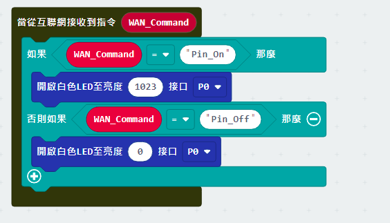
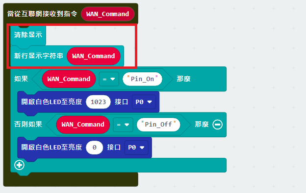

# 章節3: 利用App Inventor 2控制 Micro:bit

## 簡介

App Inventor 2 是一個類似Makecode的積木型編程平台，能夠幫助初學者輕易地建立一個在Android或是IOS使用的APP。
裡面包含各種功能的元素，例如按鈕、拖拉條、日期選擇器、圖片、相機、傳感器、網頁瀏覽器等，只需要拖拉及簡單編程即可使用。<BR><P>

<P>
你可以嘗試用App inventor 2去建立一個使用網絡連接的IoT App程式來控制Micro:bit。當Micro:bit配合上IoT:bit使用互聯網控制功能時，這會一直監聽互聯網中傳來的訊息，然後執行相應的行為。所以可以在智能電話上實現一些遙控的功能，像打開LED開關等。<BR><P>

<P>


## API 應用程式介面 (control command)
<HR>
什麼是API? API全稱 '應用程式介面' ， 所指的是應用程式與應用程式之間溝通的橋樑。<BR><P>
	
而 'URL' 是其中一種在網絡上所通用的API，專門負責在網絡上帶領使用者存取指定的網絡資源，常見的有我們所輸入的網址，像www.google.com， 就能夠帶領我們前往google的網頁。<BR><P>
在IoT:bit上提供了一個專門用於Micro:bit互聯網控制功能的API，只需要在API中填入IoT:bit的 '專屬ID' 及 '要發送的訊息' ，即可以對Micro:bit作出控制。


<P>

<B><u>(1) 基本 API:</u></B>
```
https://control.smarthon.cc/publish?id=DeviceID&msg=ControlCommand
```
`id`: IoT:bit的獨立ID， 用於區分及選擇要控制/進行溝通的IoT:bit <BR>
`msg`: 要傳送的訊息<P>
例子: "https://control.smarthon.cc/publish?id=0x123456781&msg=lighton". <BR>
在這裡我們傳送 `lighton` 訊息到ID為 `0x123456781` 的IoT:bit<P>


<B><u>(2) 進階API:</u></B>
```
https://control.smarthon.cc/publish?id=DeviceID&msg=ControlCommand&value=Value
```

`id`: IoT:bit的獨立ID， 用於區分及選擇要控制/進行溝通的IoT:bit<BR>
`msg`: 要傳送的訊息<BR>
`value`: 要額外傳送的數值<P>
例子: "https://control.smarthon.cc/publish?id=0x123456781&msg=lighton&value=500" <BR>
和基本API的例子裡一樣，這裡我們傳送 `lighton` 訊息到ID為 `0x123456781` 的IoT:bit，但額外增加了一個`500`的數值，讓Micro:bit知道開燈的亮度<P>

 
## 場景例子
<HR>
<span id="subtitle">目標:</span><P>
這例子裡將會使用App inventor 2製作一個App來控制Micro:bit開關LED<BR>

<span id="subtitle">解釋: </span><P>

這例子裡分為兩部分: <P>

* 第一部分，我們需要連接Micro:bit到網絡及取得其ID 
* 第二部分，我們需要設計一個簡單的App去發送API

<P>

<P>
 
 
## 第一部分: 編程
<HR>

<span id="subtitle">目標:</span><P>
我們需要先取得Micro:bit的ID及設定好接收訊息後的行為<BR><P>

<span id="subtitle">連接圖:</span><br>
* 連接LED到P0<BR>

<P>

* 請把蜂鳴器開關 "上拉" 以斷開連接

<span id="subtitle">第一步驟:連接Wifi</span><BR><P>
在使用互聯網控制功能之前，需要先確保已連接上網絡
<BR><P>
<P>

<span id="subtitle">第二步驟:取得ID</span><BR><P>
'當Wifi連接後' 是一個事件處理器.當連接上Wifi後，這個處理器會把取得的`IP地址`及`裝置的ID`都以變量的形式提供。因此可以利用這來取得裝置的ID來進行互聯網控制。<BR>
* 初始化OLED顯示屏
* 在 `當Wifi連接後` 裡添加 `顯示字符串` ，並把ID放進去

<P>

*如你害怕忘記了ID，亦可以在互聯網控制那分頁取得裝置ID，並按需要在某時候顯示出來<P>
 

<P>


<span id="subtitle">第三步驟:按訊息執行動作</span><BR><P>
當連接上Wifi後，與控制伺服器的連接將會自動建立，可以接收訊息。<BR>
若要提取接收到的訊息，可以使用 '當從互聯網接收到指令' 來讀取訊息。然後依照訊息來執行不同的動作。<BR>
* 在 `當從互聯網接收到指令` 在添加 `如果` 條件式
* 在設定條件時，對接收到的訊息進行對比，是否與我們設定的指令相同
* 當接收到 `Pin_On` 時，把LED打開
* 當接收到 `Pin_Off` 時，把LED關閉<BR>

*注意，指令是需要區分大小階的
<P>

<P>

<span id="subtitle">第四步驟:顯示指令</span><BR><P>
在接收指令時，或者有需要把指令顯示出來以方便知悉。
* 初始化OLED顯示屏
* 添加 `顯示字符串` 並把指令顯示出來

<P>


<span id="subtitle"><u>進階應用:指令+數值</u></span><BR><P>
有時侯除了指令外，亦可能需要同時附加一個數值來控制，例如控制舵機轉動角度，LED燈的亮度等。<BR>
這時侯需使用另一個事件處理器 `當從互聯網接收到指令及數值` ，就能夠同時讀取指令及數值，並依此進行操作。<BR>

 <P>


<span id="subtitle">完整答案<BR><P>
MakeCode: [https://makecode.microbit.org/_JUDFLu75zDFV](https://makecode.microbit.org/_JUDFLu75zDFV)<BR><P>
你可以在以下網頁下載HEX檔案:<BR>
<iframe src="https://makecode.microbit.org/#pub:_JUDFLu75zDFV" width="100%" height="500" frameborder="0"></iframe><P>


## 第二部分: App Inventor 2 設定
<HR>

<H3>目標:</H3>
我們需要利用App inventor 2製造一個App 去通過API控制Micro:bit <P>

<span id="subtitle">第一步驟: 設計面板</span><BR><P>
建立一個新專案，切換到Designer板面<BR>
* 在 'Layout' ，拖動 'HorizontalArragement' 到面板上<BR>
* 在 'User Interface' ，分別拖動 'Button' 兩次到 'HorizontalArragement'
* 在 'Connectivity' 裡，拖動 'Web' 到面板上
<P>
    
<span id="subtitle">第二步驟:定義功能</span><BR><P>
切換到 'Block' 板面<BR>
* 按以下圖片拖出功能塊
<P>
* 當 Button 1和Button 2被按下的時候，呼叫API來發送訊息<P>
http://control.smarthon.cc/publish?id=`DeviceID`&msg=`ControlCommand`

<P>
 
<H3><u>進階使用:發送帶數值的指令</u></H3>
如果你想進行帶數值的控制，可以建立一個文字輸入區塊來輸入數值，並在發送訊息把數值一并傳出。<P>

<B>介面:</B><BR>
<P>

<B>編程:</B><P>
當button 3被按下時，會讀取文字區塊的數值，并呼叫能傳送數值的API<P>
http://control.smarthon.cc/publish?id=`0xfa240ac45917`&msg=`PinValue`&value=`600`<BR>

<P>

<span id="subtitle">第三步驟:組建APP</span><BR><P>
組建並打包APP後進行測試<P>
如果在智能電話上安裝了AI Companion程式，App Inventor 2能夠讓你進行實時測試<BR>

<P>

此外，亦能夠直接下載APK檔案以進行安裝及測試<P>

<P>

## 結果
<HR>

當Wifi連接後，裝置的ID將會顯示出來<P>

<P>


<U><B>簡易情況:</B></U><BR>
當Button 1被按下時，將會發送 "Pin_on" 的指令到指定ID的Micro:bit。<BR>當Micro:bit接收到指令後，將會打開在P0的LED。<BR>
如按下Button 2，則會發送 "Pin_Off" ，而Micro:bit則會把LED關燈
<P>

<P>

<U><B>使用數值控制:</B></U><BR>
當使用Button 3時，Micro:bit會依照文字區塊的數值(0或600)來控制LED。<P>

<P>


