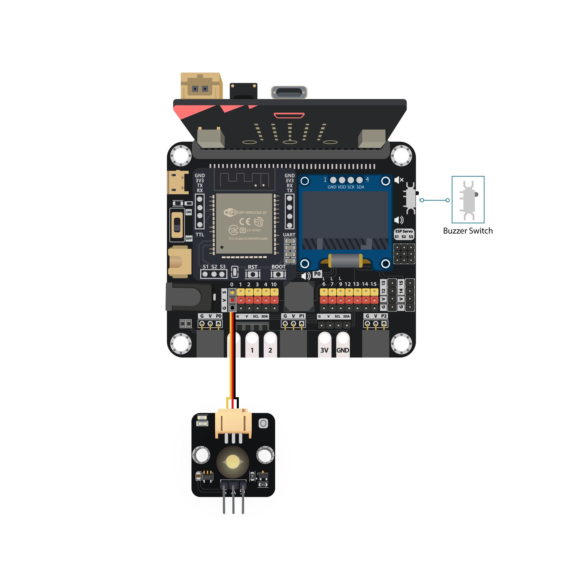
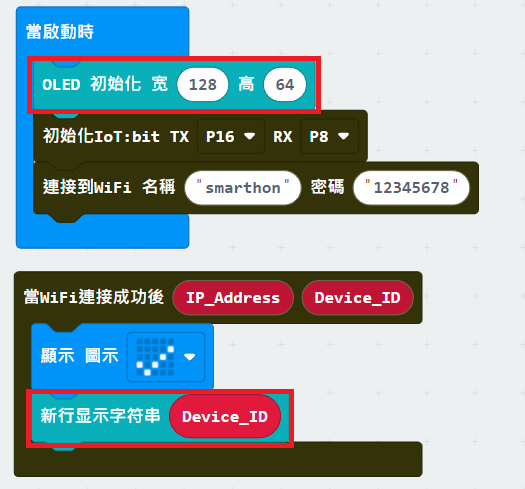
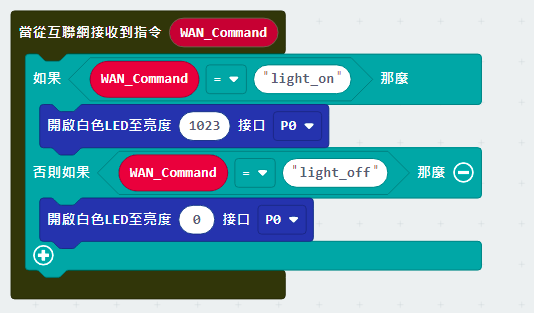
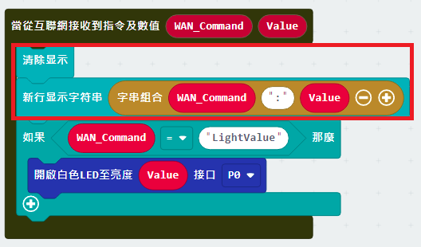

# 章節4: 由IFTTT雲控制Micro:bit

## 簡介
在這章節,你會學習到如何使用IFTTT控制Micro:bit。在IFTTT平台上提供的各種服務,例如天氣預測,時間,語音助理等,只要設定好平台後,都能夠用來控制Micro:bit。  

這裡提供數種應用的例子:
* 在每天上午6時打開LED街燈
* 在每天上午6時打開水泵進行灑水2秒
* 若天氣預測到將會下雨,打開雨傘
* 使用聲音控制機械人動作
* 當門關上時,打開LED

## 示範場境

目標: 

將Micro:bit連接上網絡,在每天的下午6時,通過IFTTT傳送指令讓Micro:bit打開LED燈。

詳情:

在這例子裡,分為兩部分: 

* 第一部分,需要先把Micro:bit連接上網絡及知道其ID 
* 第二部分, 在IFTTT裡設定好觸發條件,如在下午6時,就發送 'light_on' 指令

## 第一部分: 編程

目標:

我們需要取得ID及設定好接收指令後相應的行動 

連接圖表: 
* 連接LED到P0 

第一步驟: 連接WiFi 

先初始化IoT:bit及連上Wifi

第二步驟:取得ID 

 '當Wifi連接後'是一個事件處理器,當連接上Wifi後就會執行裡面的內容。同時這也提供了IoT:bit ID的變數,我們可以用OLED顯示屏把ID顯示出來。 

* 初始化OLED顯示屏
* 在 '當Wifi連接後' 裡添加 '顯示字串'
* 把 'Deveice_ID' 拖動到 '顯示字串' 內

*如你害怕忘記了ID,亦可以在互聯網控制那分頁取得裝置ID,並按需要在某時候顯示出來

第三步驟:設定接收指令後的行動 

當連接上Wifi後,與控制伺服器的連接將會自動建立,可以接收訊息。 
若要提取接收到的訊息,可以使用 『當從互聯網接收到指令』 來讀取訊息。然後依照訊息來執行不同的動作。

* 在 '當從互聯網接收到指令' 在添加 '如果' 條件式

* 在設定條件時,對接收到的訊息進行對比,是否與我們設定的指令相同

* 當接收到 'light_on' 時,把LED燈打開

* 當接收到 'light_off' 時,把LED燈關閉

第四步驟:顯示接收的指令 

在接收指令時,或者有需要把指令顯示出來以方便知悉,使用OLED顯示屏就能輕易地看到指令。
* 初始化OLED顯示屏
* 添加 '顯示字串' 並把指令顯示出來

<H3><U>進階應用:指令+數值:</U></H3>

有時侯除了指令外,亦可能需要同時附加一個數值來控制,例如控制舵機轉動角度,LED燈的亮度等。 
這時侯需使用另一個事件處理器 '當從互聯網接收到指令及數值' ,就能夠同時讀取指令及數值,並依此進行操作。 

完整答案 

MakeCode: [https://makecode.microbit.org/_Jdb8fA66r77Y](https://makecode.microbit.org/_Jdb8fA66r77Y) 

你可以在以下網頁下載HEX檔案 
<iframe src="https://makecode.microbit.org/#pub:_Jdb8fA66r77Y" width="100%" height="500" frameborder="0"></iframe>

## 第二部分: IFTTT 設定

<H3>目標:</H3>
我們需要設定一個IFTTT Applet去控制Micro:bit

第一步驟: 建立IFTTT帳號

前往 [https://ifttt.com/](https://ifttt.com/) 註冊並登入的你帳號。 

第二步驟:建立一個Applet 

在右上角的菜單,點擊建立->Applet 

第三步驟:設定觸法條件 

IFTTT使用 '如果...則執行...動作' 的方式來運行,我們可以設定如在每天下午6時,執行開燈的指令發送。

<u>A. 觸發部分</u>

1.搜索 'Date' 然後選擇 'Date & Time'

2.設定好需要觸發的時間

* 選擇 '每天這時間..'
* 選擇下午6時0分後,創立這觸發條件

<u>B. 動作部分</u>

1.搜索 'micro:bit' 後選擇 'Smarthon IoT(micro:bit)' 

2.完成設定
* 選擇 'Control Command'
* 輸入IoT:bit的ID `Device ID` (e.g. 0xa3240ac45916) 及指令 `control command` (e.g. light_on), 然後點擊儲存

<u>可選操作</u>

如果想發送帶有數值的指令,可以在Smarthon IoT(micro:bit)那選擇 'Control Command(with value)' 

## 結果

<H3><U>常規情況:</U></H3>
當Wifi連接後,裝置的ID將會顯示出來,亦會自動連接到控制伺服器

* 在每天下午6時,IFTTT上的時鐘會觸發,讓IFTTT發送 'light_On' 指令到Micro:bit
* Micro:bit 接收到指令
* P0上的LED燈會被打開

<H3><U>進階應用(帶有數值):</U></H3>

若使用了帶數值的版本來傳送指令時,IFTTT上會多出一個數值輸入位置,可以讓我們輸入(例如600)
* 每天下午6時,IFTTT上的時鐘會觸法,讓IFTTT發送 'light_On' 及數值 '600' 
* Micro:bit接收到指令 'light_On'及數值 '600'
* 在P0的LED燈就會被以數值600的類比數值打開,而不是最亮的1023

